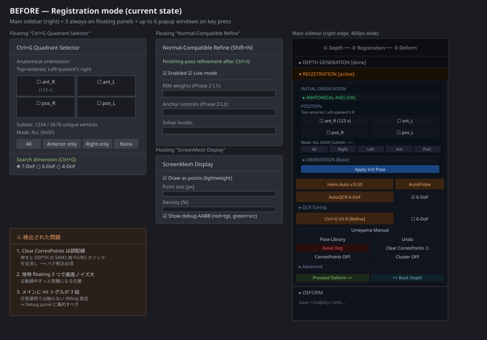
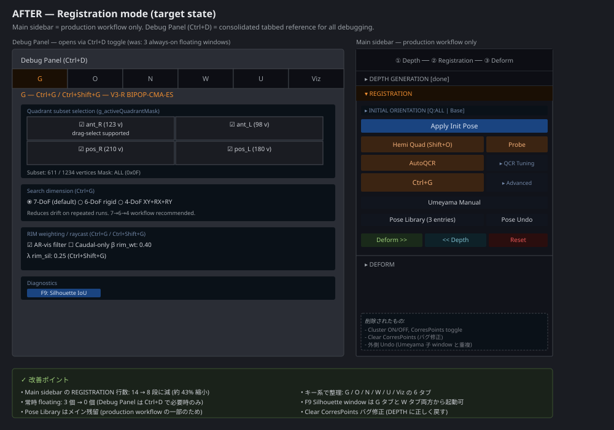
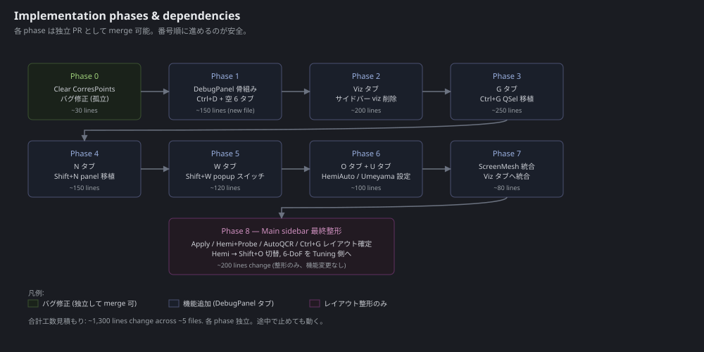

# Registration UI Refactor — Implementation Plan

**For:** Claude Code (autonomous coding agent)
**Estimated total effort:** ~1,300 lines change across ~5 files, 9 phases
**Status:** Plan ready, awaiting execution

---

## 0. Context & Goal

The Registration mode UI has grown organically over many sessions and now mixes **production workflow** with **debug/diagnostic controls** in the same sidebar. Three always-on floating panels add noise. One button (`Clear CorresPoints`) is mis-wired and clears the wrong data (DEPTH SAM2 masks instead of registration correspondence points).

**Goal:** Cleanly separate production from debug:
- **Main sidebar** = only what a non-expert user touches during a real registration session.
- **New tabbed Debug Panel** (`Ctrl+D` toggle, single floating window) = all advanced/diagnostic controls, organized by **keyboard shortcut family** (G / O / N / W / U / Viz).

**Non-goals:**
- No algorithmic changes (no behavior change for any callback).
- No deprecation of keyboard shortcuts — `Ctrl+G`, `Shift+O`, `Shift+N`, `Shift+W`, `F9` etc. all continue to work exactly as before.
- No change to the DEPTH or DEFORM section structure.

---

## 1. Before / After at a glance

### Before


### After


---

## 2. File inventory — what gets touched

| File | Role | Phase touching it |
|---|---|---|
| `RegistrationImGuiManager.h` | Main sidebar + draw orchestration | 0, 2, 3, 4, 7, 8 |
| `main.cpp` | App glue, callback wiring, floating panels | 0, 1, 2, 3, 4, 5, 6, 7 |
| `DebugPanel.h` | **NEW** — tabbed debug panel | 1 (create), 2-7 (populate) |
| `MaskPicker.h` | Used by bug fix | 0 (read-only confirm) |
| `PoseLibrary.h` | Unchanged — stays as independent window | — |

**File-system note:** Project root is shown to Claude Code at the repo root (filenames without `/mnt/project/` prefix). Line numbers below reference the current state of `main.cpp` (11614 lines) and `RegistrationImGuiManager.h` (2578 lines). If lines have shifted by a few when Claude Code arrives (due to other commits), grep for the anchor strings provided in each phase.

---

## 3. Phase progression



**Recommended order:** 0 → 1 → 2 → 3 → 4 → 5 → 6 → 7 → 8

Each phase is an independent commit. The codebase compiles and runs after every phase. Phase 0 is fully isolated and can be merged at any time without depending on the rest. Phases 1-7 each add or move one piece into the new Debug Panel. Phase 8 is pure layout cleanup of the main sidebar and runs last.

---

## 4. Critical invariants — DO NOT VIOLATE

Throughout every phase:

1. **All existing keyboard shortcuts MUST keep working.** `Ctrl+G`, `Shift+O`, `Shift+N`, `Shift+W` series, `F9`, `Ctrl+P`, `Shift+Ctrl+P`, `Alt+Ctrl+P`, `Ctrl+Shift+G` — these dispatch from the GLFW key handler in `main.cpp`. The UI changes only relocate the visual controls; the key handlers are untouched.

2. **All `RegUIActions` callbacks remain bound the same way.** `gUI.actions.onCtrlG`, `gUI.actions.onAutoQCR`, etc. — every callback wired in `main.cpp` around lines 9362-10100 stays where it is. We're moving UI controls between windows, not rewiring action handlers.

3. **The Umeyama 2-screen overlay must remain unaffected.** When `gUmeyama.active`, all the floating panels (`Ctrl+G Quadrant Selector`, `Normal-Compatible Refine`, `ScreenMesh Display`, and the new Debug Panel) MUST be suppressed — the existing guard `gApp.mode == AppMode::kRegistration && !gUmeyama.active` stays.

4. **State synchronization (`syncUIState`) is the source of truth.** Any field added to `RegUIState` for Debug Panel use must be updated in `syncUIState()` (main.cpp, around line 9200) every frame, just like existing fields. Never read `g_*` globals directly from inside `RegistrationImGuiManager.h` or `DebugPanel.h`.

5. **No new globals if avoidable.** When migrating a floating panel into a Debug Panel tab, if it currently uses a `g_*` global (e.g. `g_ctrlgSearchMode`, `g_normRefineEnabled`), keep the global. Just relocate the UI that reads/writes it.

---

## 5. Verification protocol (every phase)

After completing each phase:

1. **Compile clean.** `cmake --build build` must finish with no new warnings.
2. **Launch and reach Registration mode.** Load a sample image, run DEPTH, click `Proceed to Registration >>`.
3. **Phase-specific check.** Each phase below lists 2-4 concrete clicks/observations.
4. **Regression sweep.** Apply Init Pose → AutoQCR → Ctrl+G must still complete a successful registration. RMSE in info panel should match pre-refactor baseline (within numerical noise).
5. **Umeyama check.** Click `Umeyama Manual`, ensure 2-screen overlay appears, ensure all floating panels including new Debug Panel are hidden during overlay.
6. **Commit.** One commit per phase. Title: `[ui-refactor] PhaseN: <summary>`.

---


## Phase 0 — Bug fix: `Clear CorresPoints` mis-wiring

**Scope:** Pure bug fix. Independent of everything else. Can be merged on its own at any time.

**The bug:** In `RegistrationImGuiManager.h:1806-1809`, the button labeled `Clear CorresPoints` (placed in the REGISTRATION section) is enabled when Umeyama correspondence points exist (`boardPtCount + objPtCount > 0`) but its handler `actions.onClearPoints` is wired in `main.cpp:9362` to `MaskPicker::clear(gApp)`, which clears the DEPTH-stage SAM2 mask click points (`maskPoints` + `instrumentMaskPoints`). Two unrelated systems mashed together.

**Fix:** Remove the broken button from the REGISTRATION section. The intent it was trying to serve (clearing Umeyama point pairs) is already handled by the `Undo` button inside the Umeyama child window. The DEPTH mask-click reset is already handled by `MaskPicker::clear` being called inside `onResetRegistration` and on `onUndoSegPoint`-driven workflows; no separate "clear mask clicks" button is needed in REGISTRATION.

### Changes

**File: `RegistrationImGuiManager.h`**

Find the block at lines ~1798-1810 (anchor: `Reset Reg`, `Clear CorresPoints`). Replace:

```cpp
        ImGui::Spacing();
        {
            float bw2 = (ImGui::GetContentRegionAvail().x - 4) / 2.0f;
            if(colorButton("Reset Reg", colRed(), false, false, bw2)) {
                if(actions.onResetRegistration) actions.onResetRegistration();
                if(state.clusterVis && actions.onToggleClusterVis) actions.onToggleClusterVis();
            }
            ImGui::SameLine();
            bool hasPoints = (state.boardPtCount + state.objPtCount) > 0;
            if(colorButton("Clear CorresPoints", hasPoints ? colRed() : colDim(), false, !hasPoints, bw2)) {
                if(actions.onClearPoints) actions.onClearPoints();
            }
        }
```

With:

```cpp
        ImGui::Spacing();
        {
            // [PHASE-0 BUGFIX] Removed misrouted "Clear CorresPoints" button.
            // It was wired to MaskPicker::clear() which clears DEPTH-stage
            // SAM2 mask clicks, not registration correspondence points.
            // Umeyama point pair clearing is handled by the in-overlay Undo
            // button. DEPTH mask reset is handled by onResetRegistration
            // and the DEPTH section's existing controls.
            if(colorButton("Reset Reg", colRed(), false, false, -1)) {
                if(actions.onResetRegistration) actions.onResetRegistration();
                if(state.clusterVis && actions.onToggleClusterVis) actions.onToggleClusterVis();
            }
        }
```

(The remaining `Reset Reg` button now takes the full width.)

**Optional secondary cleanup (recommended in same commit):** The `Undo` button at line ~1791-1795 ("Undo right side") and the `onClearPoints` callback wiring in `main.cpp` can stay for now — the callback is still useful from other code paths (`onResetRegistration` indirectly relies on `MaskPicker::clear()` for DEPTH state). Do NOT remove the callback definition; only remove the misrouted button.

### Verification (Phase 0)

1. Build clean.
2. Load image, run DEPTH, proceed to REGISTRATION.
3. Confirm there is no `Clear CorresPoints` button in the REGISTRATION section.
4. Confirm `Reset Reg` button exists and takes the full width of the row.
5. Click `Reset Reg`. Pose resets, mask click points are also cleared (via the existing `MaskPicker::clear` call inside `onResetRegistration` — unchanged behavior).
6. Click `Umeyama Manual`, place a few points, click in-overlay `Undo`. Confirm individual point removal still works (uses `gUmeyama.undoPoint`, unchanged).

**Commit:** `[ui-refactor] Phase 0: Remove misrouted Clear CorresPoints button`

---

## Phase 1 — Create `DebugPanel.h` skeleton

**Scope:** Foundation. New file. No removal of any existing UI. After this phase, `Ctrl+D` opens an empty tabbed window; everything else is unchanged.

### Changes

**New file: `DebugPanel.h`**

```cpp
#pragma once

// =============================================================================
//  DebugPanel.h —  Consolidated tabbed debug/diagnostic window for Registration
//
//  Replaces (incrementally, over Phases 2-7) three always-on floating windows:
//    - "Ctrl+G Quadrant Selector"          → tab G  (Phase 3)
//    - "Normal-Compatible Refine (Shift+N)" → tab N  (Phase 4)
//    - "ScreenMesh Display"                 → tab Viz (Phase 7)
//
//  Tabs organize controls by keyboard-shortcut family:
//    G    — Ctrl+G / Ctrl+Shift+G  (V3-R BIPOP-CMA-ES region-aware refine)
//    O    — Shift+O                (HemiAuto / QuadAuto, voxel, instrument)
//    N    — Shift+N / Ctrl+Shift+N (Normal-Compatible finishing refine)
//    W    — Shift+W series         (RIM 2D projection debug popups)
//    U    — Umeyama Manual         (point-pair list, error stats)
//    Viz  — General visualization  (Cluster, CorresPoints, AABB, screen mesh)
//
//  Lifecycle:
//    static DebugPanel::State g_debugPanel;
//    // In main.cpp keyboard handler:
//    if (Ctrl+D pressed) g_debugPanel.showWindow = !g_debugPanel.showWindow;
//    // In ImGui frame, only during kRegistration && !gUmeyama.active:
//    DebugPanel::draw(g_debugPanel, gUI);  // gUI provides RegUIState ref + callbacks
// =============================================================================

#include "imgui.h"
#include "RegistrationImGuiManager.h"   // for RegUIState / RegUIActions

namespace DebugPanel {

enum Tab {
    TAB_G = 0,   // Ctrl+G
    TAB_O,       // Shift+O
    TAB_N,       // Shift+N
    TAB_W,       // Shift+W
    TAB_U,       // Umeyama
    TAB_VIZ,     // Visualization
    TAB_COUNT
};

struct State {
    bool showWindow   = false;
    int  activeTab    = TAB_G;  // initial tab on first open
};

// Internal tab draw functions (defined later phases populate these).
inline void drawTabG  (RegUIState& s, RegUIActions& a); // Phase 3
inline void drawTabO  (RegUIState& s, RegUIActions& a); // Phase 6
inline void drawTabN  (RegUIState& s, RegUIActions& a); // Phase 4
inline void drawTabW  (RegUIState& s, RegUIActions& a); // Phase 5
inline void drawTabU  (RegUIState& s, RegUIActions& a); // Phase 6
inline void drawTabViz(RegUIState& s, RegUIActions& a); // Phase 2 + 7

inline void draw(State& st, RegistrationImGuiManager& gUI) {
    if (!st.showWindow) return;

    ImGui::SetNextWindowSize(ImVec2(560.0f, 480.0f), ImGuiCond_FirstUseEver);
    ImGui::SetNextWindowBgAlpha(0.92f);
    ImGui::PushStyleVar(ImGuiStyleVar_WindowRounding, 6.0f);

    if (ImGui::Begin("Debug Panel  [Ctrl+D]", &st.showWindow,
                     ImGuiWindowFlags_NoCollapse))
    {
        if (ImGui::BeginTabBar("##debugpanel_tabs", ImGuiTabBarFlags_None)) {
            if (ImGui::BeginTabItem("G")) {
                st.activeTab = TAB_G;
                drawTabG(gUI.state, gUI.actions);
                ImGui::EndTabItem();
            }
            if (ImGui::BeginTabItem("O")) {
                st.activeTab = TAB_O;
                drawTabO(gUI.state, gUI.actions);
                ImGui::EndTabItem();
            }
            if (ImGui::BeginTabItem("N")) {
                st.activeTab = TAB_N;
                drawTabN(gUI.state, gUI.actions);
                ImGui::EndTabItem();
            }
            if (ImGui::BeginTabItem("W")) {
                st.activeTab = TAB_W;
                drawTabW(gUI.state, gUI.actions);
                ImGui::EndTabItem();
            }
            if (ImGui::BeginTabItem("U")) {
                st.activeTab = TAB_U;
                drawTabU(gUI.state, gUI.actions);
                ImGui::EndTabItem();
            }
            if (ImGui::BeginTabItem("Viz")) {
                st.activeTab = TAB_VIZ;
                drawTabViz(gUI.state, gUI.actions);
                ImGui::EndTabItem();
            }
            ImGui::EndTabBar();
        }
    }
    ImGui::End();
    ImGui::PopStyleVar();
}

// ----- Phase 1 stubs (filled in later phases) -----
inline void drawTabG  (RegUIState&, RegUIActions&) { ImGui::TextDisabled("G tab — Phase 3 will populate"); }
inline void drawTabO  (RegUIState&, RegUIActions&) { ImGui::TextDisabled("O tab — Phase 6 will populate"); }
inline void drawTabN  (RegUIState&, RegUIActions&) { ImGui::TextDisabled("N tab — Phase 4 will populate"); }
inline void drawTabW  (RegUIState&, RegUIActions&) { ImGui::TextDisabled("W tab — Phase 5 will populate"); }
inline void drawTabU  (RegUIState&, RegUIActions&) { ImGui::TextDisabled("U tab — Phase 6 will populate"); }
inline void drawTabViz(RegUIState&, RegUIActions&) { ImGui::TextDisabled("Viz tab — Phase 2/7 will populate"); }

} // namespace DebugPanel
```

**File: `main.cpp`**

1. Add include near other UI headers (search for `#include "RegistrationImGuiManager.h"` and add right after):

   ```cpp
   #include "DebugPanel.h"
   ```

2. Add the global state (search for `static SilOverlay::State g_silOverlay;` and add nearby, or near `g_poseLibrary` declaration):

   ```cpp
   static DebugPanel::State g_debugPanel;
   ```

3. Add `Ctrl+D` key handler. Find the GLFW key dispatch block (search for `GLFW_KEY_G` and locate the surrounding switch/if-chain). Add a new case:

   ```cpp
   // Ctrl+D — toggle Debug Panel
   if (key == GLFW_KEY_D && (mods & GLFW_MOD_CONTROL) && !(mods & GLFW_MOD_SHIFT)) {
       g_debugPanel.showWindow = !g_debugPanel.showWindow;
       std::cout << "[DebugPanel] " << (g_debugPanel.showWindow ? "ON" : "OFF") << std::endl;
       return;
   }
   ```

   **CAREFUL:** If `Ctrl+D` is already bound to something (grep `GLFW_KEY_D` first), pick `Ctrl+Alt+D` or another free combo and document the chosen key in `DebugPanel.h` header comment.

4. Add the draw call in the ImGui frame pass. Find the block (around `main.cpp:6519` based on current line numbers) that draws `ScreenMesh Display`, or any of the always-on registration floating windows. Add the new draw call right after them, under the same guard:

   ```cpp
   if (gApp.mode == AppMode::kRegistration && !gUmeyama.active) {
       DebugPanel::draw(g_debugPanel, gUI);
   }
   ```

### Verification (Phase 1)

1. Build clean.
2. Reach Registration mode.
3. Press `Ctrl+D`. A floating window titled `Debug Panel  [Ctrl+D]` appears with 6 tabs: G, O, N, W, U, Viz.
4. Each tab shows the placeholder text `"<X> tab — Phase <N> will populate"`.
5. Press `Ctrl+D` again. Window closes.
6. Activate Umeyama Manual → confirm Debug Panel is also hidden during Umeyama overlay.
7. The three legacy floating panels (`Ctrl+G Quadrant Selector`, `Normal-Compatible Refine`, `ScreenMesh Display`) all still appear unchanged.

**Commit:** `[ui-refactor] Phase 1: Add DebugPanel.h skeleton with Ctrl+D toggle`

---

## Phase 2 — Viz tab: migrate visualization toggles from main sidebar

**Scope:** Move `Cluster ON/OFF` and `CorresPoints ON/OFF` from the REGISTRATION section to the Debug Panel's Viz tab. Remove from main sidebar.

**Background:** These toggle `g_showClusterVisualization` and `g_showCorrespondencePoints` respectively (see `main.cpp:9601, 9760`). Both are debugging visualizations:
- **Cluster**: HemiAuto/AutoQCR K-means inlier markers (green source, blue interior, yellow boundary).
- **CorresPoints**: Umeyama clicked `boardPoints` + `objectPoints` spheres (auto-on during `SELECTING_*` states regardless of toggle).

There are also B / N / W-series visualizations (`g_showBoundaryCandidates`, `g_showSourceVisualization`, etc.) currently only togglable from keyboard. We'll surface them here too as checkboxes for visibility.

### Changes

**File: `DebugPanel.h`**

Replace the stub `drawTabViz` with:

```cpp
inline void drawTabViz(RegUIState& s, RegUIActions& a) {
    ImGui::TextColored(ImVec4(0.7f, 0.85f, 1.0f, 1.0f),
                       "Visualization toggles  (keyboard shortcuts in parens)");
    ImGui::Spacing();
    ImGui::Separator();
    ImGui::Spacing();

    // ----- Registration-result viz -----
    ImGui::TextColored(ImVec4(0.9f, 0.7f, 0.4f, 1.0f), "Registration cluster (key J):");
    {
        bool clusterVis = s.clusterVis;
        if (ImGui::Checkbox("Cluster markers  (green=src, blue=tgt-int, yellow=tgt-bnd)##viz_cluster",
                            &clusterVis)) {
            if (a.onToggleClusterVis) a.onToggleClusterVis();
        }
    }
    {
        bool corresVis = s.correspondenceVis;
        if (ImGui::Checkbox("Correspondence points  (Umeyama board+object)##viz_corres",
                            &corresVis)) {
            if (a.onToggleCorrespondenceVis) a.onToggleCorrespondenceVis();
        }
    }

    ImGui::Spacing();
    ImGui::Separator();
    ImGui::Spacing();

    ImGui::TextDisabled("More visualizations (B / N keys) — Phase 7 will surface.");
    ImGui::TextDisabled("Screen-mesh point density / debug AABB — Phase 7 will move here.");
}
```

**File: `RegistrationImGuiManager.h`**

Locate lines ~1812-1823 (anchor: `correspondenceVis ? "CorresPoints ON"`). Delete the entire block:

```cpp
        ImGui::Spacing();
        {
            float bw2 = (ImGui::GetContentRegionAvail().x - 4) / 2.0f;
            if(colorButton(state.correspondenceVis ? "CorresPoints ON" : "CorresPoints OFF",
                            state.correspondenceVis ? colGreen() : colDim(), false, false, bw2)) {
                if(actions.onToggleCorrespondenceVis) actions.onToggleCorrespondenceVis();
            }
            ImGui::SameLine();
            if(colorButton(state.clusterVis ? "Cluster ON" : "Cluster OFF",
                            state.clusterVis ? colGreen() : colDim(), false, false, bw2)) {
                if(actions.onToggleClusterVis) actions.onToggleClusterVis();
            }
        }
```

Replace with a comment marker:

```cpp
        // [PHASE-2] Cluster / CorresPoints viz toggles relocated to
        // Debug Panel > Viz tab (Ctrl+D).
```

### Verification (Phase 2)

1. Build clean.
2. REGISTRATION section no longer shows the `Cluster ON/OFF` / `CorresPoints ON/OFF` row.
3. Open Debug Panel (Ctrl+D), switch to Viz tab. See the two checkboxes.
4. Run AutoQCR or Ctrl+G to populate cluster points. Toggle `Cluster markers` in Viz tab — confirm the green/blue/yellow spheres appear/disappear in the 3D view.
5. Click Umeyama Manual, place a board point. The `Correspondence points` toggle should show points already (forced on during SELECTING). After Umeyama completes, the toggle controls visibility on its own.
6. Trigger an existing keyboard viz shortcut (e.g. press J for cluster if mapped) and confirm it still works (toggles `g_showClusterVisualization` directly, the checkbox in Viz tab reflects the change next frame via `syncUIState`).

**Commit:** `[ui-refactor] Phase 2: Viz tab — migrate Cluster/CorresPoints toggles`

---

## Phase 3 — G tab: migrate `Ctrl+G Quadrant Selector` floating panel

**Scope:** Move the entire contents of the always-on `Ctrl+G Quadrant Selector` floating window (`main.cpp:4547-4730`-ish) into the Debug Panel's G tab. **Remove the floating window.**

**Important — overlap with main sidebar's POSITION grid:** The main sidebar's `INITIAL ORIENTATION > POSITION` 2x2 grid already operates on the same `g_activeQuadrantMask` global (RegistrationImGuiManager.h:1268-1312). Therefore the **Debug Panel G tab does NOT need to redraw a 2x2 quadrant selector** — the user can already pick quadrants from the sidebar. The G tab instead shows:
- **Read-only mask preview** (current `g_activeQuadrantMask` + subset vertex count).
- **Search dimension radio** (7-DoF / 6-DoF / 4-DoF — currently only in floating panel).
- **RIM weighting / raycast knobs** (currently inside floating panel via `drawCtrlGRimRaycastControls` already shared with sidebar Advanced).
- **"F9: Open Silhouette IoU window" button**.

This is a content reduction, not just a relocation. The user already drives quadrant from the sidebar; the G tab is for the *additional* Ctrl+G settings that didn't fit in the sidebar.

### Changes

**File: `DebugPanel.h`**

Forward-declare the helper from `main.cpp` (it already exists — see `main.cpp:11216` and the `onDrawAdvancedCtrlG` callback wiring):

At top of `DebugPanel.h`, after the `#include` block:

```cpp
// Defined in main.cpp — draws RIM-weighted / raycast controls that read/write
// g_ctrlgUseArVisFilter, g_ctrlgBetaRimWeight, g_ctrlgsLambdaRimSil, etc.
// This is the same function called by RegistrationImGuiManager's Advanced
// section via the onDrawAdvancedCtrlG callback.
void drawCtrlGRimRaycastControls();
```

Replace `drawTabG` stub with:

```cpp
inline void drawTabG(RegUIState& s, RegUIActions& a) {
    ImGui::TextColored(ImVec4(0.95f, 0.7f, 0.3f, 1.0f),
                       "G — Ctrl+G / Ctrl+Shift+G — V3-R BIPOP-CMA-ES");
    ImGui::TextWrapped(
        "Region-aware refinement driven by g_activeQuadrantMask. "
        "Set quadrants from sidebar INITIAL ORIENTATION > POSITION; "
        "this tab exposes the additional search-mode and RIM knobs.");
    ImGui::Spacing();
    ImGui::Separator();
    ImGui::Spacing();

    // ----- Read-only mask + subset preview -----
    ImGui::TextColored(ImVec4(0.7f, 0.85f, 1.0f, 1.0f),
                       "Active subset (driven by sidebar POSITION):");
    if (s.quadLabelsReady) {
        ImGui::Text("  Mask: 0x%02X    Subset: %d / %d vertices",
                    (unsigned)s.activeQuadrantMask,
                    s.quadSubsetCount, s.quadTotalCount);
        ImGui::Text("  ant_R=%d  ant_L=%d  pos_R=%d  pos_L=%d",
                    s.quadNAR, s.quadNAL, s.quadNPR, s.quadNPL);
    } else {
        ImGui::TextColored(ImVec4(1.0f, 0.6f, 0.2f, 1.0f),
                           "  Labels not computed (Shift+R / Y or H to auto-compute).");
    }
    ImGui::Spacing();
    ImGui::Separator();
    ImGui::Spacing();

    // ----- Search dimension radio (g_ctrlgSearchMode via callback) -----
    ImGui::TextColored(ImVec4(0.85f, 1.0f, 0.7f, 1.0f),
                       "Search dimension (Ctrl+G):");
    // Mirrors the radio from the legacy floating panel. The Sidebar's
    // "Ctrl+G 6-DoF" checkbox is the same setting; both reflect each other
    // via syncUIState (ctrlgLockScale ↔ g_ctrlgSearchMode).
    {
        // Reuse the existing onDrawAdvancedCtrlG callback path? No — that
        // covers RIM/raycast knobs (see below). For Search dim, we read the
        // mode the same way the sidebar does (state.ctrlgLockScale = true
        // means 6-DoF rigid). For 4-DoF, we need direct radio access.
        // Strategy: keep the radio writing g_ctrlgSearchMode directly via
        // a new callback OR keep the existing direct-globals approach used
        // by the legacy panel.
        //
        // RECOMMENDED: lift the radio block from main.cpp:4691-4730 verbatim
        // into here (it already writes g_ctrlgSearchMode globals directly,
        // which is fine for a debug panel — the rule "no globals in
        // RegistrationImGuiManager.h" applies to the production sidebar;
        // DebugPanel is allowed to touch globals because it IS the place
        // where the dev surface lives).
    }
    // INSERT: the radio button block from main.cpp:4691-4730 (3 radios:
    //   7-DoF: T+R+Scale (default)
    //   6-DoF rigid: T+R, scale=1
    //   4-DoF XY+RX+RY: tx, ty, rx, ry
    // with tooltips. The block reads/writes g_ctrlgSearchMode. To keep
    // DebugPanel.h header-only and avoid pulling in CmaesRefineV3R.h,
    // forward-declare g_ctrlgSearchMode as extern at the top of the file
    // and use integer casts as the existing legacy panel already does.)

    ImGui::Spacing();
    ImGui::Separator();
    ImGui::Spacing();

    // ----- RIM weighting / raycast (shared helper) -----
    ImGui::TextColored(ImVec4(0.85f, 1.0f, 0.7f, 1.0f),
                       "RIM weighting / raycast:");
    drawCtrlGRimRaycastControls();   // same helper as sidebar Advanced

    ImGui::Spacing();
    ImGui::Separator();
    ImGui::Spacing();

    // ----- F9 quick-open -----
    ImGui::TextColored(ImVec4(0.85f, 1.0f, 0.7f, 1.0f), "Diagnostics:");
    extern SilOverlay::State g_silOverlay;   // defined in main.cpp
    if (ImGui::Button("F9: Toggle Silhouette IoU window")) {
        g_silOverlay.showWindow = !g_silOverlay.showWindow;
    }
    ImGui::SameLine();
    ImGui::TextDisabled(g_silOverlay.showWindow ? "(currently open)" : "(currently closed)");
}
```

**Forward declarations needed in `DebugPanel.h`:**

```cpp
// Forward declare external globals/types used inside DebugPanel tabs.
namespace SilOverlay { struct State; }
namespace CmaesRefineV3R { enum class SearchMode; }
extern int g_ctrlgSearchMode;   // actually CmaesRefineV3R::SearchMode; cast as needed
```

Adjust types to match actual decls in `main.cpp`. Check actual symbols with `grep "g_ctrlgSearchMode\b" main.cpp` to confirm exact type before adding the extern.

**File: `main.cpp`**

Remove the `Ctrl+G Quadrant Selector` floating window. Find the block starting at line ~4547:

```cpp
if (gApp.mode == AppMode::kRegistration && !gUmeyama.active) {
    ImGui::SetNextWindowBgAlpha(0.7f);
    ImGui::Begin("Ctrl+G Quadrant Selector", ...);
    // ... ~200 lines ...
    ImGui::End();
}
```

Delete the entire block. The contents have been migrated:
- Quadrant 2x2 checkbox → already in sidebar POSITION (no migration needed).
- Convenience buttons (All / Anterior only / Right only / None) → already in sidebar Quick Presets (no migration needed).
- Search dimension radio → migrated to DebugPanel G tab.
- RIM / raycast controls (`drawCtrlGRimRaycastControls`) → already accessible from sidebar Advanced; now also from G tab.

### Verification (Phase 3)

1. Build clean.
2. Reach REGISTRATION. The `Ctrl+G Quadrant Selector` floating window is **gone**.
3. Open Debug Panel > G tab.
4. Verify "Active subset" lines update live when you tick quadrant checkboxes in the sidebar POSITION 2x2 grid.
5. Change search dimension radio in G tab. Run Ctrl+G. Verify the debug log prints the expected mode (`SEVEN_DOF` / `SIX_DOF_RIGID` / `FOUR_DOF_XYRXRY`).
6. Toggle RIM/raycast checkboxes in G tab. The same checkboxes in sidebar Advanced should reflect the change next frame (shared globals).
7. Click "F9: Toggle Silhouette IoU window". The F9 silhouette window appears. Press F9 key. Window toggles. Click button again. Toggles again. Three sources of truth converge.

**Commit:** `[ui-refactor] Phase 3: G tab — migrate Ctrl+G Quadrant Selector to Debug Panel`

---

## Phase 4 — N tab: migrate `Normal-Compatible Refine` floating panel

**Scope:** Move the entire `Normal-Compatible Refine (Shift+N)` floating panel (`main.cpp:6246-6517` approximately) into Debug Panel N tab. **Remove the floating window.**

### Changes

**File: `DebugPanel.h`**

Replace `drawTabN` stub. Strategy: same as Phase 3 — instead of duplicating the entire content, lift the body of the legacy `ImGui::Begin("Normal-Compatible Refine (Shift+N)", ...)` block (everything between `Begin` and `End`) verbatim into `drawTabN`. The panel uses globals (`g_normRefineEnabled`, `g_normRefineLiveMode`, and several rim-weight / anchor / solver knobs) directly — that's fine for DebugPanel.

```cpp
inline void drawTabN(RegUIState& /*s*/, RegUIActions& /*a*/) {
    ImGui::TextColored(ImVec4(0.7f, 0.95f, 0.7f, 1.0f),
                       "N — Shift+N / Ctrl+Shift+N — Normal-Compatible Refine");
    ImGui::TextWrapped(
        "Finishing-pass refinement after Ctrl+G. "
        "Source/target filters are shared with Ctrl+G (AR-vis / Caudal / "
        "Quadrant globals). Rim weights + anchor controls live here.");
    ImGui::Spacing();
    ImGui::Separator();

    // INSERT: contents of main.cpp:6252-6516 verbatim.
    // (Master enable, Live mode, RIM weights, Anchor controls, Solver knobs,
    //  any diagnostic readouts.)
    // Globals used: g_normRefineEnabled, g_normRefineLiveMode,
    //   g_normRefineRimL1Weight, g_normRefineAnchorL2Weight, etc.
    // Declare any needed externs at file top.
}
```

**File: `main.cpp`**

Delete the floating-window block at `main.cpp:6246-6517`:

```cpp
if (gApp.mode == AppMode::kRegistration && !gUmeyama.active) {
    ImGui::SetNextWindowBgAlpha(0.7f);
    ImGui::Begin("Normal-Compatible Refine (Shift+N)", ...);
    // ... entire body ...
    ImGui::End();
}
```

### Verification (Phase 4)

1. Build clean.
2. The `Normal-Compatible Refine` floating window is gone.
3. Open Debug Panel > N tab. All controls from the legacy panel are visible.
4. Run a session: Apply Init Pose → Ctrl+G → Shift+N. Verify Shift+N still refines correctly.
5. Toggle Live mode checkbox in N tab. Verify the live-vs-blocking behavior change matches pre-refactor.

**Commit:** `[ui-refactor] Phase 4: N tab — migrate Normal-Compatible Refine to Debug Panel`

---

## Phase 5 — W tab: Shift+W RIM-projection popups + F9 access

**Scope:** Surface the 5-6 Shift+W debug popup windows as checkboxes in the W tab. Add second "F9: Open Silhouette IoU" entry point (matches user request that F9 be accessible from both G and W tabs).

**Background:** The Shift+W popups are toggled by individual `g_debugShow2DProjPopup_*` flags in `main.cpp`:
- `g_debugShow2DProjPopup_RawRim`
- `g_debugShow2DProjPopup_RawRimSmoothed`
- `g_debugShow2DProjPopup_RawRimOrdered`
- `g_debugShow2DProjPopup_OverlayProbe`
- `g_debugShow2DProjPopup_SrcRim`
- `g_debugShow2DProjPopup_TgtRim`

Each currently has its own key combo (Shift+W series) and its own `ImGui::Begin` block. We don't move those `Begin` blocks — they stay as their own popups. We just give the user a panel to **toggle them on/off without remembering the key combos**.

### Changes

**File: `DebugPanel.h`**

```cpp
inline void drawTabW(RegUIState& /*s*/, RegUIActions& /*a*/) {
    ImGui::TextColored(ImVec4(0.85f, 0.75f, 1.0f, 1.0f),
                       "W — Shift+W series — RIM 2D projection debug");
    ImGui::TextWrapped(
        "Each entry opens a separate popup window. "
        "Keyboard shortcuts (Shift+W base + suffix) continue to work.");
    ImGui::Spacing();
    ImGui::Separator();
    ImGui::Spacing();

    extern bool g_debugShow2DProjPopup_RawRim;
    extern bool g_debugShow2DProjPopup_RawRimSmoothed;
    extern bool g_debugShow2DProjPopup_RawRimOrdered;
    extern bool g_debugShow2DProjPopup_OverlayProbe;
    extern bool g_debugShow2DProjPopup_SrcRim;
    extern bool g_debugShow2DProjPopup_TgtRim;

    ImGui::TextColored(ImVec4(0.7f, 0.85f, 1.0f, 1.0f), "Stage 0 — raw / smoothed / ordered RIM:");
    ImGui::Checkbox("Raw RIM 2D projection (Stage 0)##w_rawrim",
                    &g_debugShow2DProjPopup_RawRim);
    ImGui::Checkbox("Smoothed RIM (Stage 0.1)##w_rawrim_sm",
                    &g_debugShow2DProjPopup_RawRimSmoothed);
    ImGui::Checkbox("Ordered RIM (Stage 0.2)##w_rawrim_ord",
                    &g_debugShow2DProjPopup_RawRimOrdered);
    ImGui::Checkbox("Overlay probe (Stage 0.3)##w_overlay",
                    &g_debugShow2DProjPopup_OverlayProbe);

    ImGui::Spacing();
    ImGui::TextColored(ImVec4(0.7f, 0.85f, 1.0f, 1.0f), "Stage 3d — source / target rim:");
    ImGui::Checkbox("Source rim 2D projection##w_src",
                    &g_debugShow2DProjPopup_SrcRim);
    ImGui::Checkbox("Target rim lower-half + anchors##w_tgt",
                    &g_debugShow2DProjPopup_TgtRim);

    ImGui::Spacing();
    ImGui::Separator();
    ImGui::Spacing();

    // F9 — Silhouette IoU window (same entry point as G tab; user asked
    // for this to be accessible from both G and W tabs).
    ImGui::TextColored(ImVec4(0.85f, 1.0f, 0.7f, 1.0f), "Silhouette IoU diagnostic:");
    extern SilOverlay::State g_silOverlay;
    if (ImGui::Button("F9: Toggle Silhouette IoU window##w_f9")) {
        g_silOverlay.showWindow = !g_silOverlay.showWindow;
    }
    ImGui::SameLine();
    ImGui::TextDisabled(g_silOverlay.showWindow ? "(currently open)" : "(currently closed)");
}
```

**Note on exact extern names:** before writing the externs, run `grep "g_debugShow2DProj" main.cpp` to confirm the exact symbol names. If any are `static` to the file, they need to be promoted to non-static and declared `extern` in a small header (or `main.cpp` needs to expose them via accessor functions).

**File: `main.cpp`**

No deletion — the popup `Begin` blocks at lines 7461, 7734, 8105, 8342, 8831, 9013 stay as-is. They render only when their flag is true.

### Verification (Phase 5)

1. Build clean.
2. Open Debug Panel > W tab. See 6 checkboxes + F9 button.
3. Tick "Raw RIM 2D projection (Stage 0)". The popup window appears.
4. Untick. Closes.
5. Press the keyboard shortcut for the same popup (Shift+W base). Same popup opens/closes. Both control surfaces work.
6. Click F9 button in W tab and in G tab. Both toggle the same Silhouette IoU window.

**Commit:** `[ui-refactor] Phase 5: W tab — Shift+W popup switches + dual F9 access`

---

## Phase 6 — O tab + U tab (smaller)

**Scope:** Populate the remaining two tabs.

### O tab — Shift+O / HemiAuto / QuadAuto settings

Surface controls that currently live scattered in the sidebar or only as keyboard shortcuts:
- **Hemi voxel size slider** (currently shown only on `Hemi Auto` button rim, removed from button label in Phase 8).
- **Instrument Px threshold slider** (currently shown only when `regMethod==1 && instrumentMaskActive`; moved here for unconditional access).
- **AutoProbe N (iter cycles)** if we want to expose it.

```cpp
inline void drawTabO(RegUIState& s, RegUIActions& a) {
    ImGui::TextColored(ImVec4(0.95f, 0.65f, 0.3f, 1.0f),
                       "O — Shift+O — HemiAuto / QuadAuto");
    ImGui::Spacing();
    ImGui::Separator();
    ImGui::Spacing();

    // Hemi voxel size
    ImGui::TextColored(ImVec4(0.7f, 0.85f, 1.0f, 1.0f), "Voxel size (downsampling):");
    {
        float v = s.hemiVoxelSize;
        if (ImGui::SliderFloat("##o_voxel", &v, 0.1f, 2.0f, "%.2f")) {
            if (a.onHemiVoxelChanged) a.onHemiVoxelChanged(v);
        }
        ImGui::TextDisabled("  Recommended: 1:1 = %.2f, 1:1.5 = %.2f, 1:2 = %.2f",
                            s.idealVoxel1to1, s.idealVoxel1to15, s.idealVoxel1to2);
    }
    ImGui::Spacing();

    // Instrument Px threshold (was conditional in sidebar)
    ImGui::TextColored(ImVec4(0.7f, 0.85f, 1.0f, 1.0f),
                       "Instrument-mask Px threshold:");
    {
        float v = s.instrumentPxThresh;
        if (ImGui::SliderFloat("##o_instpx", &v, 0.0f, 50.0f, "%.0f px")) {
            if (a.onInstrumentPxThreshChanged) a.onInstrumentPxThreshChanged(v);
        }
        ImGui::TextDisabled("  Affects next Shift+O run. Watch red rejection points with B key.");
    }
    ImGui::Spacing();

    // AutoProbe iter cycles
    ImGui::TextColored(ImVec4(0.7f, 0.85f, 1.0f, 1.0f), "AutoProbe iterations:");
    ImGui::SliderInt("##o_iter", &s.iterCycles, 1, 25, "K = %d");
    if (ImGui::Button("Run AutoProbe x K")) {
        if (a.onIterativeAutoProbe) a.onIterativeAutoProbe(s.iterCycles);
    }
}
```

### U tab — Umeyama Manual diagnostics

Show Umeyama pair stats and current state (read-only). Manual operation stays in the sidebar `Umeyama Manual` flow.

```cpp
inline void drawTabU(RegUIState& s, RegUIActions& /*a*/) {
    ImGui::TextColored(ImVec4(0.4f, 0.85f, 1.0f, 1.0f),
                       "U — Umeyama Manual diagnostics");
    ImGui::TextWrapped(
        "Read-only view of the current Umeyama session. "
        "Operate via sidebar 'Umeyama Manual' button.");
    ImGui::Spacing();
    ImGui::Separator();
    ImGui::Spacing();

    ImGui::Text("Board points:  %d / %d", s.boardPtCount, s.targetPtCount);
    ImGui::Text("Object points: %d / %d", s.objPtCount,   s.targetPtCount);
    ImGui::Spacing();

    if (s.useRegistration) {
        ImGui::TextColored(ImVec4(0.7f, 0.95f, 0.7f, 1.0f), "Last result:");
        ImGui::Text("  Avg error: %.3f mm", s.avgError);
        ImGui::Text("  RMSE:      %.3f mm", s.rmse);
        ImGui::Text("  Max error: %.3f mm", s.maxError);
        ImGui::Text("  Scale:     %.4f", s.scaleFactor);
    } else {
        ImGui::TextDisabled("No registration applied yet.");
    }
}
```

### Verification (Phase 6)

1. Build clean.
2. Open Debug Panel > O tab. Adjust voxel slider. Sidebar Advanced > Voxel slider reflects the change (same global).
3. Adjust Instrument Px threshold. Run Shift+O. Confirm threshold takes effect.
4. Click "Run AutoProbe x K". K iterations run.
5. Open Debug Panel > U tab. Run Umeyama Manual. Watch board/object counts increment in real time as you click. After Execute, RMSE etc. populate.

**Commit:** `[ui-refactor] Phase 6: O tab + U tab — HemiAuto knobs and Umeyama stats`

---

## Phase 7 — ScreenMesh Display migration + B/N key visualizations

**Scope:** Migrate the `ScreenMesh Display` always-on floating panel into Debug Panel Viz tab. Also surface `g_showBoundaryCandidates` (B key) and `g_showSourceVisualization` (N key) toggles.

### Changes

**File: `DebugPanel.h`** — extend `drawTabViz` (from Phase 2):

```cpp
inline void drawTabViz(RegUIState& s, RegUIActions& a) {
    // ===== Section 1: registration-result viz (from Phase 2) =====
    ImGui::TextColored(ImVec4(0.9f, 0.7f, 0.4f, 1.0f), "Registration markers:");
    {
        bool clusterVis = s.clusterVis;
        if (ImGui::Checkbox("Cluster (green=src, blue=tgt-int, yellow=tgt-bnd)##viz_cluster",
                            &clusterVis)) {
            if (a.onToggleClusterVis) a.onToggleClusterVis();
        }
    }
    {
        bool corresVis = s.correspondenceVis;
        if (ImGui::Checkbox("Correspondence points (Umeyama)##viz_corres",
                            &corresVis)) {
            if (a.onToggleCorrespondenceVis) a.onToggleCorrespondenceVis();
        }
    }

    extern bool g_showBoundaryCandidates;
    extern bool g_showSourceVisualization;
    ImGui::Checkbox("Boundary candidates (B key)##viz_b", &g_showBoundaryCandidates);
    ImGui::Checkbox("Source visualization (N key)##viz_n", &g_showSourceVisualization);

    ImGui::Spacing();
    ImGui::Separator();
    ImGui::Spacing();

    // ===== Section 2: screen-mesh point rendering (from old floating panel) =====
    extern bool  g_screenMeshAsPoints;
    extern float g_screenMeshPointSize;
    extern float g_screenMeshDensity;
    // g_screenMeshPC is a class instance — expose a flag for reshuffle request.
    extern bool  g_screenMeshReshuffleRequested;   // see main.cpp Phase 7 note

    ImGui::TextColored(ImVec4(0.7f, 0.85f, 1.0f, 1.0f), "Screen mesh rendering:");
    ImGui::Checkbox("Draw as points (lightweight)##viz_screenpts",
                    &g_screenMeshAsPoints);
    if (g_screenMeshAsPoints) {
        ImGui::SliderFloat("Point size [px]##viz_ptsize",
                           &g_screenMeshPointSize, 1.0f, 8.0f, "%.1f");
        ImGui::SliderFloat("Density [%]##viz_density",
                           &g_screenMeshDensity, 1.0f, 100.0f, "%.0f");
        if (ImGui::Button("Reshuffle##viz_reshuffle")) {
            g_screenMeshReshuffleRequested = true;
        }
    }

    ImGui::Spacing();
    ImGui::Separator();
    ImGui::Spacing();

    // ===== Section 3: debug AABB =====
    extern bool g_showDebugBB;
    ImGui::TextColored(ImVec4(0.7f, 0.85f, 1.0f, 1.0f), "Debug bounding boxes:");
    ImGui::Checkbox("Show AABB (red=target, green=source)##viz_aabb",
                    &g_showDebugBB);
    // Source AABB diagnostic readout (preserved from legacy ScreenMesh Display)
    if (g_showDebugBB) {
        extern bool g_dbgSourceBB_valid;
        // g_dbgSourceBB_center and g_targetAabbFull provide error data;
        // forward-decl required types or expose via accessors.
        // For simplicity, just print "see ScreenMesh debug" as readouts;
        // implementer can copy the |err| computation from main.cpp:6549-6554.
        ImGui::TextDisabled("  (See main.cpp:6549 for |err| readout — copy verbatim.)");
    }
}
```

**File: `main.cpp`**

1. **Delete the `ScreenMesh Display` floating window** at lines ~6519-6557:
   ```cpp
   if (gApp.mode == AppMode::kRegistration && !gUmeyama.active) {
       ImGui::SetNextWindowBgAlpha(0.7f);
       ImGui::Begin("ScreenMesh Display", ...);
       // ... ~38 lines ...
       ImGui::End();
   }
   ```

2. **Add a small bridge for `Reshuffle`:** the existing code calls `g_screenMeshPC.requestReshuffle()` directly. Since `DebugPanel.h` can't easily depend on the PC class, introduce a flag:
   ```cpp
   bool g_screenMeshReshuffleRequested = false;   // set true by DebugPanel button
   ```
   Then near where `g_screenMeshPC` is updated each frame, check and clear:
   ```cpp
   if (g_screenMeshReshuffleRequested) {
       g_screenMeshPC.requestReshuffle();
       g_screenMeshReshuffleRequested = false;
   }
   ```

### Verification (Phase 7)

1. Build clean.
2. `ScreenMesh Display` floating window is gone.
3. Open Debug Panel > Viz tab. See all sections: Registration markers, Screen mesh rendering, Debug bounding boxes.
4. Toggle "Draw as points". Mesh display changes. Adjust point size + density. Click Reshuffle.
5. Toggle Debug AABB. Red + green corner spheres appear in 3D view.
6. Press B key. Boundary candidates appear. Confirm the Viz tab checkbox reflects state (via syncUIState writing `g_showBoundaryCandidates` to state).

**Commit:** `[ui-refactor] Phase 7: Viz tab — migrate ScreenMesh Display and surface B/N key viz`

---

## Phase 8 — Main sidebar final layout

**Scope:** Now that all debug controls have moved to Debug Panel, restructure the main sidebar's REGISTRATION section into the clean 8-row layout per the AFTER mockup. Pure layout cleanup; no functional change beyond what previous phases already did.

### Target layout (REGISTRATION section, post-Phase 8)

```
▾ REGISTRATION
  ▸ INITIAL ORIENTATION  [Q:ALL | Base]      ← collapsing header (was always-expanded child window)
  [          Apply Init Pose          ]      ← full width
  [ Hemi Quad (Shift+O) ] [   Probe    ]    ← 2/3 + 1/3
  [      AutoQCR        ] [ ▸ QCR Tun. ]    ← 2/3 + 1/3 (right side = collapsing tuning)
  [       Ctrl+G        ] [ ▸ Advanced ]    ← 2/3 + 1/3
  [          Umeyama Manual           ]      ← full width (kept; user wants as future main path)
  [ Pose Library (3) ] [   Pose Undo  ]    ← 1/2 + 1/2 (kept per user request)
  [ Deform >> ][ << Depth ][ Reset    ]     ← 1/3 + 1/3 + 1/3 footer nav
```

### Key changes from current code

1. **INITIAL ORIENTATION → CollapsingHeader** (replace `BeginChild`). Header label shows current `[Q:<mask> | <preset>]` so it's readable when collapsed. Auto-open if `!useRegistration && quadLabelsReady`, otherwise default-collapsed.

2. **Rename `Hemi Auto` → `Hemi Quad (Shift+O)`** and rewire callback from `onHemiAuto` to `onQuadAuto`. Drop the `v:0.50` voxel readout from the button rim (voxel slider lives in Debug Panel O tab and sidebar Advanced).

3. **`AutoQCR  6-DoF` → `AutoQCR`** (drop the 6-DoF label suffix). Remove the right-side `☑ 6-DoF` checkbox; the 6-DoF setting moves into the `▸ QCR Tuning` collapsing header (which was already next to it, just promote it to occupy the right 1/3).

4. **`Ctrl+G  V3-R  [Refine]` → `Ctrl+G`** (shorter). Remove the right-side `☑ 6-DoF` checkbox; the 6-DoF / 4-DoF setting is now in Debug Panel G tab. Right 1/3 becomes `▸ Advanced` collapsing header.

5. **`Pose Library` button label** updated to include count, e.g. `Pose Library (3)` if `state.poseEntryCount > 0` else `Pose Library`.

6. **Footer row** combines `Proceed Deform >>`, `<< Back Depth`, `Reset Reg` into 3-column layout. Was previously 2 separate 2-column rows.

7. **Delete redundant outer Umeyama `Undo` button** (already inside Umeyama child window).

### Code structure

Replace `drawRegistrationSection()` (lines 1508-1885) with the cleaned version. The full replacement is too long to inline here verbatim — the implementing agent should:

1. Read current `drawRegistrationSection()` end-to-end first.
2. Preserve all top-of-function guards (mainMode==1 done case, !regPhaseActive_ &&  mainMode==0 case, depthBusy case).
3. Replace the `drawInitOrientationPanel()` call site by inlining a CollapsingHeader wrapper around the existing function (or modify `drawInitOrientationPanel` itself to be a CollapsingHeader body).
4. Apply the renamings/rewirings listed above.
5. Keep `drawDeformSection`, `drawSaveAR`, `drawVisibility`, `drawInfoPanel` calls in the outer `draw()` function unchanged.

### Verification (Phase 8)

1. Build clean.
2. Main sidebar REGISTRATION section matches AFTER mockup row-for-row.
3. Click each button — workflow runs to completion: Apply → Shift+O → AutoQCR → Ctrl+G → final RMSE matches pre-refactor baseline.
4. Toggle INITIAL ORIENTATION CollapsingHeader. When collapsed, `[Q:<mask> | <preset>]` accurately reflects current state.
5. Footer 3-button row: Deform>> / <<Depth / Reset all work.
6. Run a full end-to-end registration session. Total time + final RMSE should match pre-Phase-0 baseline (we haven't changed any algorithm; only the layout and Debug Panel are restructured).

**Commit:** `[ui-refactor] Phase 8: Main sidebar layout final cleanup`

---

## 6. Risk register

| Risk | Likelihood | Mitigation |
|---|---|---|
| Ctrl+D conflicts with existing binding | Low | Grep first; fallback to Ctrl+Alt+D |
| Extern global types differ from forward-decl | Medium | Run `grep` to confirm types before adding extern in DebugPanel.h |
| F9 dual-binding causes double-toggle | Low | Both code paths just flip the same bool; idempotent |
| Phase 8 layout change accidentally drops a callback | Medium | Diff `onXxx` callbacks before/after; keep RegUIActions struct unchanged |
| Umeyama overlay guard accidentally dropped | Low | Every floating-window draw site must keep the `!gUmeyama.active` guard |

---

## 7. Out-of-scope (deferred to future refactors)

- DEPTH section restructuring.
- DEFORM section restructuring.
- Pose Library window itself (works fine as-is).
- AR Screenshot window.
- F9 Silhouette IoU window (works fine as standalone; we only add new entry points to it).
- Keyboard shortcut consolidation/documentation page.

---

## 8. Final checklist

After all 9 phases (0-8):

- [ ] Build clean, no new warnings.
- [ ] All keyboard shortcuts work (test: G, Shift+G, Ctrl+G, Ctrl+Shift+G, Shift+O, Shift+N, Ctrl+Shift+N, F9, Shift+W series).
- [ ] All 3 legacy always-on floating panels are removed (Ctrl+G Quadrant Selector, Normal-Compatible Refine, ScreenMesh Display).
- [ ] Debug Panel opens with Ctrl+D, has 6 populated tabs.
- [ ] Pose Library still in main sidebar.
- [ ] Umeyama Manual still in main sidebar.
- [ ] End-to-end registration: Apply Init Pose → Shift+O → AutoQCR → Ctrl+G → Shift+N produces same final RMSE as pre-refactor (within numerical noise).
- [ ] Umeyama 2-screen mode hides Debug Panel correctly.
- [ ] `Clear CorresPoints` button no longer exists in REGISTRATION section.

**End of plan.**
