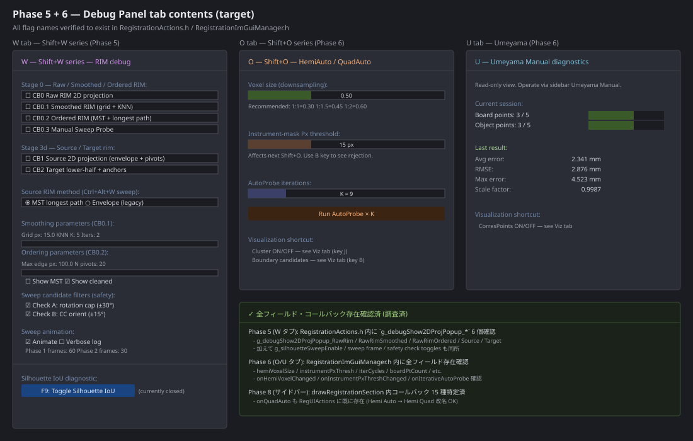
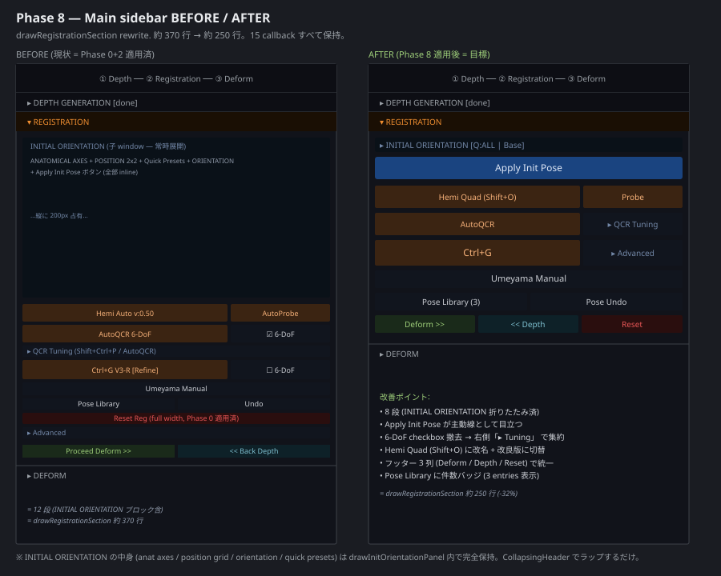

# Registration UI Refactor — Phase 5 + 6 + 8 Implementation Plan

**For:** Claude Code (autonomous coding agent)
**Branch:** `ui-refactor` (continues from existing branch)
**Predecessor:** `IMPLEMENTATION_REPORT.md` (Phases 0-4, 7 already merged)
**Path C selected:** Complete the refactor in order: Phase 5 → Phase 6 → Phase 8
**Estimated effort:** ~700 lines change, 3 commits, 2-4 hours total

---

## 0. Context — what's done, what's left

The original plan (`docs/ui-refactor/UI_REFACTOR_PLAN.md`) had 9 phases (0-8). Phases 0, 1, 2, 3, 4, 7 are merged and building clean. Three phases remain:

| Phase | Title | Risk | Visible to user? |
|---|---|---|---|
| **5** | W tab — Shift+W RIM debug popup toggles | Low | Yes — W tab no longer says "Phase 5 will populate" |
| **6** | O + U tabs — HemiAuto knobs & Umeyama stats | Low | Yes — O and U tabs become functional |
| **8** | Main sidebar layout cleanup | **Medium-high** | Yes — sidebar visibly cleaner (8 rows vs 12) |

**This document is the complete spec for all three.** Each phase = one commit. The hook pattern from Phases 3/4/7 is reused where it makes sense (Phase 8 doesn't need it; Phases 5/6 do not need it either — flags/state are clean and self-contained).

---

## 1. Reconnaissance — pre-flight verification (done)

Before writing this plan, all flag names, field names, and callback names referenced below were **verified to exist** in the current source tree by reading `RegistrationActions.h` and `RegistrationImGuiManager.h` directly:

| Symbol | File | Confirmed |
|---|---|---|
| `g_debugShow2DProjPopup_RawRim` | `RegistrationActions.h` | ✓ inline bool |
| `g_debugShow2DProjPopup_RawRimSmoothed` | `RegistrationActions.h` | ✓ inline bool |
| `g_debugShow2DProjPopup_RawRimOrdered` | `RegistrationActions.h` | ✓ inline bool |
| `g_debugShow2DProjPopup_Source` | `RegistrationActions.h` | ✓ inline bool |
| `g_debugShow2DProjPopup_Target` | `RegistrationActions.h` | ✓ inline bool |
| `g_rawRimSmooth_GridPx`, `_KnnK`, `_KnnIters`, `_ShowRawOverlay` | `RegistrationActions.h` | ✓ inline float/int/bool |
| `g_rawRimOrder_MaxEdgePx`, `_NPivots`, `_ShowMST`, `_ShowCleaned` | `RegistrationActions.h` | ✓ inline float/int/bool |
| `g_silSwSrcRimMethod` (enum SrcRimMethod) | `RegistrationActions.h` | ✓ inline int |
| `g_silhouetteSweepFrames1/2`, `g_silhouetteSweepLog`, `g_silhouetteSweepAnimate` | `RegistrationActions.h` | ✓ inline int/bool |
| `g_silSwCheckA_Enable/RotCapDeg`, `g_silSwCheckB_Enable/CCToleranceDeg` | `RegistrationActions.h` | ✓ inline bool/float |
| `SilOverlay::State` + `g_silOverlay` | `SilOverlayDebug.h` | ✓ struct + inline singleton |
| `state.hemiVoxelSize`, `state.idealVoxel1to1/15/2` | `RegistrationImGuiManager.h:218-221` | ✓ |
| `state.instrumentPxThresh`, `state.iterCycles` | `RegistrationImGuiManager.h:222,239` | ✓ |
| `state.boardPtCount`, `objPtCount`, `targetPtCount` | `RegistrationImGuiManager.h:180` | ✓ |
| `state.avgError`, `rmse`, `maxError`, `scaleFactor`, `useRegistration` | `RegistrationImGuiManager.h:185-190` | ✓ |
| `state.poseEntryCount` | `RegistrationImGuiManager.h:177` | ✓ |
| `actions.onHemiVoxelChanged`, `onInstrumentPxThreshChanged`, `onIterativeAutoProbe` | `RegistrationImGuiManager.h:41,96,81` | ✓ |
| `actions.onQuadAuto` (for Phase 8 Hemi Auto → Hemi Quad rename) | `RegistrationImGuiManager.h:38` | ✓ |

**No new fields/callbacks need to be added to `RegUIState` or `RegUIActions`.** All Phase 5/6/8 implementations can directly use what exists.

---

## 2. Critical invariants (all phases)

Repeating the rules from the original plan because Phase 8 in particular needs them:

1. **All keyboard shortcuts continue to work unchanged.** We're not touching the GLFW dispatch.
2. **All `actions.onXxx` callbacks remain bound.** Phase 8 in particular renames buttons; the underlying callback wiring in `main.cpp` does NOT change. We just call a different callback from a different button label.
3. **Umeyama 2-screen overlay guard preserved.** The `if (state.mainMode == 1) ... return;` and `umeyamaSplit` early-returns at the top of `drawRegistrationSection` MUST stay.
4. **No new globals if not needed.** Phases 5 and 6 use existing globals only.
5. **`syncUIState` is the source of truth.** Any field already mirrored there stays mirrored. We don't touch `syncUIState` in this plan.

---

## 3. Visual reference

### Phase 5 + 6 — Debug Panel tab contents


### Phase 8 — Sidebar before/after


---

## Phase 5 — W tab implementation

**Scope:** Populate the W tab in `DebugPanel.h` with checkboxes that toggle the existing `g_debugShow2DProjPopup_*` flags, plus the Stage 0.1/0.2 parameter sliders, sweep frame budget, safety checks, and F9 button.

**Files touched:** `DebugPanel.h` only.

**Design pattern:** Direct flag access. NO hook pattern needed — these globals are all in `RegistrationActions.h` which is included by `main.cpp`, and we add `extern` declarations at the top of `DebugPanel.h` to access them.

### Step 5.1 — Add extern declarations

At the top of `DebugPanel.h`, immediately after the existing `#include` block (after `#include "RegistrationImGuiManager.h"`), add:

```cpp
// =============================================================================
// Forward declarations for Phase 5 (W tab) — silhouette-sweep RIM debug.
// All defined as `inline bool/float/int` in RegistrationActions.h.
// =============================================================================
namespace SilOverlay { struct State; }
extern SilOverlay::State g_silOverlay;   // defined in SilOverlayDebug.h (inline)

// Popup toggles (Stage 0 / Stage 3d)
extern bool g_debugShow2DProjPopup_RawRim;          // CB0  — raw points
extern bool g_debugShow2DProjPopup_RawRimSmoothed;  // CB0.1 — grid+KNN smoothed
extern bool g_debugShow2DProjPopup_RawRimOrdered;   // CB0.2 — MST longest path
extern bool g_debugShow2DProjPopup_Source;          // CB1  — source 2D + pivots
extern bool g_debugShow2DProjPopup_Target;          // CB2  — target lower-half

// CB0.1 smoothing parameters
extern float g_rawRimSmooth_GridPx;
extern int   g_rawRimSmooth_KnnK;
extern int   g_rawRimSmooth_KnnIters;
extern bool  g_rawRimSmooth_ShowRawOverlay;

// CB0.2 ordering parameters
extern float g_rawRimOrder_MaxEdgePx;
extern int   g_rawRimOrder_NPivots;
extern bool  g_rawRimOrder_ShowMST;
extern bool  g_rawRimOrder_ShowCleaned;

// Source RIM discretization method (Ctrl+Alt+W sweep)
extern int g_silSwSrcRimMethod;   // 0=ENVELOPE, 1=MST_LONGEST_PATH

// Sweep frame pacing + logging
extern int  g_silhouetteSweepFrames1;
extern int  g_silhouetteSweepFrames2;
extern bool g_silhouetteSweepLog;
extern bool g_silhouetteSweepAnimate;

// Sweep candidate safety checks
extern bool  g_silSwCheckA_Enable;
extern float g_silSwCheckA_RotCapDeg;
extern bool  g_silSwCheckB_Enable;
extern float g_silSwCheckB_CCToleranceDeg;
```

**Note on `inline` vs `extern`:** the source uses `inline bool g_foo = false;` (C++17 inline variables). This means the symbol has external linkage but is defined inline in the header. An `extern bool g_foo;` declaration in another header is legal and resolves correctly. **Do not** initialize the value here — only the inline definition initializes.

### Step 5.2 — Replace `drawTabW` stub

Find the current stub in `DebugPanel.h`:

```cpp
inline void drawTabW  (RegUIState&, RegUIActions&) { ImGui::TextDisabled("W tab — Phase 5 will populate"); }
```

Replace with:

```cpp
inline void drawTabW(RegUIState& /*s*/, RegUIActions& /*a*/) {
    ImGui::TextColored(ImVec4(0.85f, 0.75f, 1.0f, 1.0f),
                       "W — Shift+W series — RIM 2D projection debug");
    ImGui::TextWrapped(
        "Each checkbox opens a separate ImGui popup window in the main frame. "
        "Keyboard shortcuts (Shift+W base + suffix) continue to work; these "
        "toggles are just a single place to find them.");
    ImGui::Spacing();
    ImGui::Separator();
    ImGui::Spacing();

    // ===== Section 1: Stage 0 — Raw/Smoothed/Ordered RIM popups =====
    ImGui::TextColored(ImVec4(0.7f, 0.85f, 1.0f, 1.0f),
                       "Stage 0 — Source RIM discretization debug:");
    ImGui::Checkbox("CB0  Raw RIM 2D projection (points only)##w_raw",
                    &g_debugShow2DProjPopup_RawRim);
    ImGui::Checkbox("CB0.1  Smoothed RIM (grid + KNN)##w_sm",
                    &g_debugShow2DProjPopup_RawRimSmoothed);
    if (g_debugShow2DProjPopup_RawRimSmoothed) {
        ImGui::Indent(16);
        ImGui::SliderFloat("Grid px##w_sm_grid",
                           &g_rawRimSmooth_GridPx, 5.0f, 50.0f, "%.1f");
        ImGui::SliderInt("KNN K##w_sm_k",
                         &g_rawRimSmooth_KnnK, 1, 20);
        ImGui::SliderInt("KNN iters##w_sm_iter",
                         &g_rawRimSmooth_KnnIters, 1, 10);
        ImGui::Checkbox("Show raw overlay##w_sm_raw",
                        &g_rawRimSmooth_ShowRawOverlay);
        ImGui::Unindent(16);
    }

    ImGui::Checkbox("CB0.2  Ordered RIM (MST + longest path)##w_ord",
                    &g_debugShow2DProjPopup_RawRimOrdered);
    if (g_debugShow2DProjPopup_RawRimOrdered) {
        ImGui::Indent(16);
        ImGui::SliderFloat("MST edge max px##w_ord_edge",
                           &g_rawRimOrder_MaxEdgePx, 20.0f, 300.0f, "%.0f");
        ImGui::SliderInt("Pivots##w_ord_pivots",
                         &g_rawRimOrder_NPivots, 5, 50);
        ImGui::Checkbox("Show MST overlay##w_ord_mst",
                        &g_rawRimOrder_ShowMST);
        ImGui::Checkbox("Show cleaned overlay##w_ord_clean",
                        &g_rawRimOrder_ShowCleaned);
        ImGui::Unindent(16);
    }

    ImGui::Spacing();
    ImGui::Separator();
    ImGui::Spacing();

    // ===== Section 2: Stage 3d — Source / Target rim popups =====
    ImGui::TextColored(ImVec4(0.7f, 0.85f, 1.0f, 1.0f),
                       "Stage 3d — Source / Target rim popups:");
    ImGui::Checkbox("CB1  Source 2D projection (envelope + pivots)##w_src",
                    &g_debugShow2DProjPopup_Source);
    ImGui::Checkbox("CB2  Target lower-half + anchors##w_tgt",
                    &g_debugShow2DProjPopup_Target);

    ImGui::Spacing();
    ImGui::Separator();
    ImGui::Spacing();

    // ===== Section 3: Source RIM method =====
    ImGui::TextColored(ImVec4(0.7f, 0.85f, 1.0f, 1.0f),
                       "Source RIM method (Ctrl+Alt+W sweep):");
    {
        int m = g_silSwSrcRimMethod;
        if (ImGui::RadioButton("MST longest path  (default, open arch)##w_method_mst",
                               m == 1)) g_silSwSrcRimMethod = 1;
        ImGui::SameLine();
        if (ImGui::RadioButton("Envelope (legacy)##w_method_env",
                               m == 0)) g_silSwSrcRimMethod = 0;
    }

    ImGui::Spacing();
    ImGui::Separator();
    ImGui::Spacing();

    // ===== Section 4: Sweep safety checks =====
    ImGui::TextColored(ImVec4(0.7f, 0.85f, 1.0f, 1.0f),
                       "Sweep candidate filters:");
    ImGui::Checkbox("Check A: rotation cap##w_chka",
                    &g_silSwCheckA_Enable);
    if (g_silSwCheckA_Enable) {
        ImGui::SameLine();
        ImGui::SetNextItemWidth(120);
        ImGui::SliderFloat("##w_chka_deg", &g_silSwCheckA_RotCapDeg,
                           5.0f, 90.0f, "±%.0f°");
    }
    ImGui::Checkbox("Check B: CC orientation##w_chkb",
                    &g_silSwCheckB_Enable);
    if (g_silSwCheckB_Enable) {
        ImGui::SameLine();
        ImGui::SetNextItemWidth(120);
        ImGui::SliderFloat("##w_chkb_deg", &g_silSwCheckB_CCToleranceDeg,
                           5.0f, 45.0f, "±%.0f°");
    }

    ImGui::Spacing();
    ImGui::Separator();
    ImGui::Spacing();

    // ===== Section 5: Sweep animation =====
    ImGui::TextColored(ImVec4(0.7f, 0.85f, 1.0f, 1.0f), "Sweep animation:");
    ImGui::Checkbox("Animate##w_anim", &g_silhouetteSweepAnimate);
    ImGui::SameLine();
    ImGui::Checkbox("Verbose log##w_log", &g_silhouetteSweepLog);
    ImGui::Spacing();
    ImGui::SliderInt("Phase 1 frames##w_f1", &g_silhouetteSweepFrames1, 1, 240);
    ImGui::SliderInt("Phase 2 frames##w_f2", &g_silhouetteSweepFrames2, 1, 120);

    ImGui::Spacing();
    ImGui::Separator();
    ImGui::Spacing();

    // ===== Section 6: F9 silhouette IoU button =====
    // User-requested: F9 button accessible from BOTH G tab AND W tab.
    // (See also the equivalent button at the bottom of drawTabG hook in
    // main.cpp Phase 3.)
    ImGui::TextColored(ImVec4(0.85f, 1.0f, 0.7f, 1.0f),
                       "Silhouette IoU diagnostic:");
    if (ImGui::Button("F9: Toggle Silhouette IoU window##w_f9")) {
        g_silOverlay.showWindow = !g_silOverlay.showWindow;
    }
    ImGui::SameLine();
    ImGui::TextDisabled(g_silOverlay.showWindow
                            ? "(currently open)"
                            : "(currently closed)");
}
```

### Step 5.3 — Verify F9 button in G tab also exists

The user explicitly requested F9 accessibility from both G and W tabs. The G tab currently uses the hook pattern (`drawGBody` lambda in `main.cpp`). Verify the lambda includes an F9 button; if it does NOT, add the same button block at the end of the G hook lambda in `main.cpp`:

```cpp
// In main.cpp, inside the drawGBody = [&]() { ... } lambda, near the end:
ImGui::Spacing();
ImGui::Separator();
ImGui::Spacing();
ImGui::TextColored(ImVec4(0.85f, 1.0f, 0.7f, 1.0f), "Silhouette IoU diagnostic:");
if (ImGui::Button("F9: Toggle Silhouette IoU window##g_f9")) {
    SilOverlay::g_silOverlay.showWindow = !SilOverlay::g_silOverlay.showWindow;
}
ImGui::SameLine();
ImGui::TextDisabled(SilOverlay::g_silOverlay.showWindow
                        ? "(currently open)"
                        : "(currently closed)");
```

Note the unique label suffix `##g_f9` vs `##w_f9` so ImGui treats them as distinct widgets.

### Verification (Phase 5)

1. Build clean (no new warnings; in particular, no "multiple definition" or "undefined reference" errors — confirms the extern declarations resolve correctly to the inline definitions in `RegistrationActions.h`).
2. Reach Registration mode. Press `Ctrl+D`. W tab now shows the full layout instead of "Phase 5 will populate".
3. Tick `CB0 Raw RIM 2D projection`. The corresponding popup window appears in the main frame.
4. Untick. Popup closes.
5. Tick `CB0.1`. Expand sub-sliders (GridPx / KnnK / KnnIters / ShowRawOverlay) become visible.
6. Press F9 keyboard shortcut. Silhouette IoU window appears. The W tab F9 button text changes to "(currently open)".
7. Click F9 button in W tab. Window closes. Text changes back.
8. Open G tab. The G tab F9 button reflects the same state (shared `g_silOverlay.showWindow`).
9. Run a Ctrl+Alt+W sweep. Watch the sweep complete. Toggle `Verbose log` mid-session — log verbosity changes immediately.

**Commit message:** `[ui-refactor] Phase 5: W tab — silhouette-sweep RIM popup toggles + F9 access`

---

## Phase 6 — O tab + U tab implementation

**Scope:** Populate O and U tab stubs in `DebugPanel.h`. Both use only `RegUIState` fields and `RegUIActions` callbacks that already exist; no externs, no hooks.

**Files touched:** `DebugPanel.h` only.

### Step 6.1 — Replace `drawTabO` stub

Find:

```cpp
inline void drawTabO  (RegUIState&, RegUIActions&) { ImGui::TextDisabled("O tab — Phase 6 will populate"); }
```

Replace with:

```cpp
inline void drawTabO(RegUIState& s, RegUIActions& a) {
    ImGui::TextColored(ImVec4(0.95f, 0.65f, 0.3f, 1.0f),
                       "O — Shift+O — HemiAuto / QuadAuto");
    ImGui::TextWrapped(
        "Settings consumed by the next Shift+O run. Sidebar Advanced > Voxel "
        "slider mirrors the voxel value here (same global).");
    ImGui::Spacing();
    ImGui::Separator();
    ImGui::Spacing();

    // ===== Voxel size =====
    ImGui::TextColored(ImVec4(0.7f, 0.85f, 1.0f, 1.0f),
                       "Voxel size (downsampling):");
    {
        float v = s.hemiVoxelSize;
        if (ImGui::SliderFloat("##o_voxel", &v, 0.1f, 2.0f, "%.2f")) {
            if (a.onHemiVoxelChanged) a.onHemiVoxelChanged(v);
        }
        ImGui::TextDisabled("  Recommended ratios:  1:1=%.2f  1:1.5=%.2f  1:2=%.2f",
                            s.idealVoxel1to1, s.idealVoxel1to15, s.idealVoxel1to2);
    }

    ImGui::Spacing();
    ImGui::Separator();
    ImGui::Spacing();

    // ===== Instrument Px threshold =====
    ImGui::TextColored(ImVec4(0.7f, 0.85f, 1.0f, 1.0f),
                       "Instrument-mask Px threshold:");
    {
        float v = s.instrumentPxThresh;
        if (ImGui::SliderFloat("##o_instpx", &v, 0.0f, 50.0f, "%.0f px")) {
            if (a.onInstrumentPxThreshChanged) a.onInstrumentPxThreshChanged(v);
        }
        ImGui::TextDisabled(
            "  Affects next Shift+O run. Use B key to see rejection points.");
    }

    ImGui::Spacing();
    ImGui::Separator();
    ImGui::Spacing();

    // ===== AutoProbe iter cycles =====
    ImGui::TextColored(ImVec4(0.7f, 0.85f, 1.0f, 1.0f), "AutoProbe iterations:");
    ImGui::SliderInt("##o_iter", &s.iterCycles, 1, 25, "K = %d");
    ImGui::Spacing();
    if (ImGui::Button("Run AutoProbe × K##o_runiter",
                      ImVec2(-1, 24.0f)))
    {
        if (a.onIterativeAutoProbe) a.onIterativeAutoProbe(s.iterCycles);
    }

    ImGui::Spacing();
    ImGui::Separator();
    ImGui::Spacing();

    // ===== Related viz shortcuts =====
    ImGui::TextColored(ImVec4(0.7f, 0.85f, 1.0f, 1.0f), "Related visualizations:");
    ImGui::TextDisabled("  Cluster (green/blue/yellow) — see Viz tab (J key).");
    ImGui::TextDisabled("  Boundary candidates / source viz — see Viz tab (B / N keys).");
}
```

### Step 6.2 — Replace `drawTabU` stub

Find:

```cpp
inline void drawTabU  (RegUIState&, RegUIActions&) { ImGui::TextDisabled("U tab — Phase 6 will populate"); }
```

Replace with:

```cpp
inline void drawTabU(RegUIState& s, RegUIActions& /*a*/) {
    ImGui::TextColored(ImVec4(0.4f, 0.85f, 1.0f, 1.0f),
                       "U — Umeyama Manual diagnostics");
    ImGui::TextWrapped(
        "Read-only view of current Umeyama session and last result. "
        "Operate via sidebar 'Umeyama Manual' button (manual mode opens "
        "a 2-screen overlay).");
    ImGui::Spacing();
    ImGui::Separator();
    ImGui::Spacing();

    // ===== Current session point counts =====
    ImGui::TextColored(ImVec4(0.7f, 0.85f, 1.0f, 1.0f), "Current session:");
    {
        // Progress-bar style readout: filled portion proportional to count/target.
        float boardFrac = (s.targetPtCount > 0)
            ? (float)s.boardPtCount / (float)s.targetPtCount : 0.0f;
        float objFrac   = (s.targetPtCount > 0)
            ? (float)s.objPtCount   / (float)s.targetPtCount : 0.0f;
        ImGui::Text("Board points:");
        ImGui::SameLine(160);
        ImGui::Text("%d / %d", s.boardPtCount, s.targetPtCount);
        ImGui::ProgressBar(boardFrac, ImVec2(-1, 6), "");
        ImGui::Spacing();
        ImGui::Text("Object points:");
        ImGui::SameLine(160);
        ImGui::Text("%d / %d", s.objPtCount, s.targetPtCount);
        ImGui::ProgressBar(objFrac, ImVec2(-1, 6), "");
    }

    ImGui::Spacing();
    ImGui::Separator();
    ImGui::Spacing();

    // ===== Last result =====
    if (s.useRegistration) {
        ImGui::TextColored(ImVec4(0.7f, 0.95f, 0.7f, 1.0f), "Last registration result:");
        const float diag = (s.modelBBoxDiag > 0.0f) ? s.modelBBoxDiag : 1.0f;
        ImGui::Text("  Avg error:");
        ImGui::SameLine(180);
        ImGui::Text("%.4f  (%.2f%%)", s.avgError, s.avgError / diag * 100.0f);
        ImGui::Text("  RMSE:");
        ImGui::SameLine(180);
        ImGui::Text("%.4f  (%.2f%%)", s.rmse, s.rmse / diag * 100.0f);
        ImGui::Text("  Max error:");
        ImGui::SameLine(180);
        ImGui::Text("%.4f  (%.2f%%)", s.maxError, s.maxError / diag * 100.0f);
        ImGui::Text("  Scale factor:");
        ImGui::SameLine(180);
        ImGui::Text("%.4f", s.scaleFactor);
        ImGui::Text("  Model size:");
        ImGui::SameLine(180);
        ImGui::Text("%.4f", diag);
    } else {
        ImGui::TextDisabled("No registration applied yet.");
    }

    ImGui::Spacing();
    ImGui::Separator();
    ImGui::Spacing();

    // ===== Related viz shortcut =====
    ImGui::TextColored(ImVec4(0.7f, 0.85f, 1.0f, 1.0f), "Related visualization:");
    ImGui::TextDisabled("  CorresPoints (board+object spheres) — see Viz tab.");
}
```

### Verification (Phase 6)

1. Build clean.
2. Open Debug Panel > O tab. See voxel slider, instrument Px slider, AutoProbe section.
3. Drag voxel slider. Confirm sidebar Advanced > Voxel slider reflects same value next frame.
4. Drag instrument Px slider. Run Shift+O. Confirm log shows new threshold in effect.
5. Set K=5, click `Run AutoProbe × K`. Confirm 5 iterations run (look at the log).
6. Open U tab.
7. Start Umeyama Manual from sidebar. As you click board/object points, U tab progress bars update.
8. Execute Umeyama. U tab "Last result" section now shows non-zero avg/rmse/max errors and scale.

**Commit message:** `[ui-refactor] Phase 6: O tab (HemiAuto knobs) + U tab (Umeyama diagnostics)`

---

## Phase 8 — Main sidebar final layout

**Scope:** Rewrite `drawRegistrationSection()` in `RegistrationImGuiManager.h` (lines 1508-~1885) to the clean 8-row target layout. Wrap `drawInitOrientationPanel()` in a CollapsingHeader. Rename Hemi Auto → Hemi Quad (Shift+O) and rewire callback. Remove redundant 6-DoF checkboxes. Combine footer buttons into 3-column row. Add Pose Library entry count badge.

**Files touched:** `RegistrationImGuiManager.h` only.

**Risk level:** **Medium-high.** This rewrites ~370 lines and touches 15 callbacks. Mitigation: pre/post diff of callback usage (see Step 8.0).

### Step 8.0 — Pre-flight callback diff

**Before** making any change, run this in the repo root and save the output:

```bash
awk '/void drawRegistrationSection/,/^    void drawDeformSection/' \
    RegistrationImGuiManager.h \
    | grep -oE "actions\.\w+" | sort -u > /tmp/callbacks_phase8_before.txt
cat /tmp/callbacks_phase8_before.txt
```

Expected output (15 unique callbacks based on current state):

```
actions.onAutoProbe
actions.onAutoQCR
actions.onCtrlG
actions.onCtrlgLockScaleChanged
actions.onDrawAdvancedCtrlG
actions.onExecuteUmeyama
actions.onHemiAuto
actions.onInstrumentPxThreshChanged
actions.onIterativeAutoProbe
actions.onPoseLibraryToggle
actions.onPoseUndo
actions.onResetRegistration
actions.onStartUmeyama
actions.onSwitchToDeformMode
actions.onToggleClusterVis
actions.onUndoUmeyamaPoint
```

**After** Phase 8 implementation, run the same command and save to `/tmp/callbacks_phase8_after.txt`. Diff them:

```bash
diff /tmp/callbacks_phase8_before.txt /tmp/callbacks_phase8_after.txt
```

**Expected diff:**

```diff
- actions.onHemiAuto         # removed: replaced by onQuadAuto (Hemi Quad)
- actions.onToggleClusterVis # removed: Reset Reg no longer auto-toggles cluster off
+ actions.onQuadAuto         # added: Hemi Quad (Shift+O) button
```

If you see ANY callback removed that is NOT in this expected diff, **stop and investigate** — you've dropped a callback unintentionally. If you see ANY callback added that is NOT in this expected diff, also investigate (probably added by mistake).

Note: `onInstrumentPxThreshChanged` will be removed from sidebar (moves to Debug Panel O tab in Phase 6) — but since Phase 6 came before Phase 8, the callback is still bound and used by O tab, so it won't show as "removed from project entirely". The diff above is per-function (inside drawRegistrationSection only).

Actually correction: the instrument Px slider in the current sidebar (line ~1722-1741 in the post-Phase-0+2 state) shows conditionally. We can leave it in the sidebar (it's only a few lines) OR remove it now that Debug Panel O tab has the same slider. Recommendation: **remove from sidebar** since O tab has it. Then the diff expectation becomes:

```diff
- actions.onHemiAuto
- actions.onInstrumentPxThreshChanged
- actions.onToggleClusterVis
+ actions.onQuadAuto
```

### Step 8.1 — Wrap INITIAL ORIENTATION in CollapsingHeader

The current `drawInitOrientationPanel()` (line 1112-1506) creates a `BeginChild("##initOrient", ...)` block that is always expanded. We change the call site (in `drawRegistrationSection` at line 1555) from:

```cpp
drawInitOrientationPanel();
```

To a CollapsingHeader-wrapped version. **Do NOT** modify `drawInitOrientationPanel()` itself — wrap it externally:

```cpp
// ===== INITIAL ORIENTATION (collapsing) =====
{
    // Build dynamic header label showing current Q-mask + Orient preset
    constexpr uint8_t kMaskNone = 0x00;
    constexpr uint8_t kMaskAll  = 0x0F;
    char qstr[24];
    if (state.activeQuadrantMask == kMaskNone)      std::snprintf(qstr, sizeof(qstr), "NONE");
    else if (state.activeQuadrantMask == kMaskAll)  std::snprintf(qstr, sizeof(qstr), "ALL");
    else std::snprintf(qstr, sizeof(qstr), "0x%02X", (unsigned)state.activeQuadrantMask);

    char hdrLabel[96];
    std::snprintf(hdrLabel, sizeof(hdrLabel),
                  "INITIAL ORIENTATION  [Q:%s | %s]###initorient_hdr",
                  qstr, presetLabel(state.initRotPreset));

    // Auto-open before Apply has set up labels; auto-close after.
    // useRegistration becomes true once any registration applied → fold up.
    if (!state.useRegistration && !state.quadLabelsReady) {
        ImGui::SetNextItemOpen(true, ImGuiCond_Once);
    }

    ImGui::PushStyleColor(ImGuiCol_Header,        ImVec4(0.10f, 0.12f, 0.16f, 0.7f));
    ImGui::PushStyleColor(ImGuiCol_HeaderHovered, ImVec4(0.15f, 0.18f, 0.24f, 0.8f));
    ImGui::PushStyleColor(ImGuiCol_HeaderActive,  ImVec4(0.20f, 0.24f, 0.32f, 0.9f));
    ImGui::PushStyleColor(ImGuiCol_Text,          ImVec4(0.55f, 0.70f, 0.90f, 1.0f));
    bool ioOpen = ImGui::CollapsingHeader(hdrLabel);
    ImGui::PopStyleColor(4);

    if (ioOpen) {
        drawInitOrientationPanel();  // unchanged — still draws ANATOMICAL AXES,
                                     // POSITION grid, ORIENTATION sub-header,
                                     // and Apply Init Pose button inside.
    }
}
```

### Step 8.2 — Hemi Auto → Hemi Quad (Shift+O) rename

Find the block at current lines 1557-1581 (the `STAGE 1: Hemi Auto (2/3) + AutoProbe (1/3)` block). Replace:

```cpp
        // --- STAGE 1: Hemi Auto (2/3 width) + AutoProbe (1/3 width) ---
        {
            const float gap     = 4.0f;
            const float availW  = ImGui::GetContentRegionAvail().x;
            const float hemiW   = (availW - gap) * 0.66f;

            if(glowButton("Hemi Auto", colReg(), anyP && state.regMethod!=1, hemiW, 52, state.btnIconTex[RegUIState::ICON_HEMI_AUTO])) {
                state.regMethod = 1; if(actions.onHemiAuto) actions.onHemiAuto();
            }
            {
                ImVec2 p = ImGui::GetItemRectMin();
                ImVec2 sz = ImGui::GetItemRectSize();
                char buf[16]; snprintf(buf, sizeof(buf), "v:%.2f", state.hemiVoxelSize);
                ImVec2 ts = ImGui::CalcTextSize(buf);
                ImGui::GetWindowDrawList()->AddText(
                    ImVec2(p.x + sz.x - ts.x - 6, p.y + (sz.y - ts.y) * 0.5f),
                    IM_COL32(120,220,160,180), buf);
            }

            // AutoProbe: HemiAuto の右隣 (残り 1/3)
            ImGui::SameLine(0.0f, gap);
            if(glowButton("AutoProbe", colReg(), anyP, -1, 52, 0)) {
                if(actions.onAutoProbe) actions.onAutoProbe();
            }
        }
        ImGui::Spacing();
```

With:

```cpp
        // --- STAGE 1: Hemi Quad (Shift+O, 2/3 width) + AutoProbe (1/3 width) ---
        // [Phase 8 rename] Hemi Auto → Hemi Quad (Shift+O):
        //   Calls onQuadAuto instead of onHemiAuto. onQuadAuto is the
        //   AR-fixed-view ∩ quadrant intersection variant (Shift+O key) —
        //   the improved method. onHemiAuto callback is preserved in
        //   RegUIActions for keyboard-shortcut compatibility and other
        //   code paths; only the sidebar button is rerouted.
        //   v:0.50 voxel readout on button rim removed — same value is
        //   shown in Debug Panel O tab and sidebar Advanced.
        {
            const float gap     = 4.0f;
            const float availW  = ImGui::GetContentRegionAvail().x;
            const float hemiW   = (availW - gap) * 0.66f;

            if(glowButton("Hemi Quad (Shift+O)", colReg(),
                          anyP && state.regMethod!=1, hemiW, 52,
                          state.btnIconTex[RegUIState::ICON_HEMI_AUTO]))
            {
                state.regMethod = 1;
                if(actions.onQuadAuto) actions.onQuadAuto();
            }

            // Probe: right 1/3 of the row
            ImGui::SameLine(0.0f, gap);
            if(glowButton("Probe", colReg(), anyP, -1, 52, 0)) {
                if(actions.onAutoProbe) actions.onAutoProbe();
            }
        }
        ImGui::Spacing();
```

### Step 8.3 — AutoQCR row: drop 6-DoF checkbox, full-width button

Find the AutoQCR row at current lines 1591-1621. Replace:

```cpp
        {
            float totalW = ImGui::GetContentRegionAvail().x;
            float gap2 = ImGui::GetStyle().ItemSpacing.x;
            float wAutoQcr = totalW * (2.0f / 3.0f) - gap2;
            const char* label = state.autoQcrLockScale
                                    ? "AutoQCR  6-DoF"
                                    : "AutoQCR  7-DoF";
            // ... [BUGFIX comment block] ...
            if(glowButton(label, colReg(), anyP, wAutoQcr, 52, 0)) {
                if(actions.onAutoQCR) actions.onAutoQCR(state.autoQcrLockScale);
            }

            ImGui::SameLine(0.0f, gap2);
            // 6-DoF checkbox (右側 1/3)
            bool lockScale = state.autoQcrLockScale;
            if (ImGui::Checkbox("6-DoF", &lockScale)) {
                const_cast<RegUIState&>(state).autoQcrLockScale = lockScale;
            }
        }
        ImGui::Spacing();
```

With:

```cpp
        // [Phase 8] AutoQCR row: button takes 2/3 width, right 1/3 is the
        // QCR Tuning collapsing header (so user can adjust the same setting
        // by opening Tuning below). The 6-DoF/7-DoF mode is now toggled
        // inside QCR Tuning, not on the main button rim. Default behaviour
        // unchanged (6-DoF lock_scale=true).
        {
            float totalW   = ImGui::GetContentRegionAvail().x;
            float gap2     = ImGui::GetStyle().ItemSpacing.x;
            float wAutoQcr = totalW * (2.0f / 3.0f) - gap2;

            if(glowButton("AutoQCR", colReg(), anyP, wAutoQcr, 52, 0)) {
                if(actions.onAutoQCR) actions.onAutoQCR(state.autoQcrLockScale);
            }

            // Right 1/3: QCR Tuning collapsing header (was a separate row
            // below; now sits beside its launch button for visual locality).
            ImGui::SameLine(0.0f, gap2);
            ImGui::BeginGroup();
            ImGui::SetNextItemOpen(false, ImGuiCond_Once);  // default closed
            if (ImGui::CollapsingHeader("QCR Tuning###qcr_tuning_hdr",
                                         ImGuiTreeNodeFlags_None))
            {
                // [Note] Body of QCR Tuning preserved verbatim from current
                // lines 1634-1671 — move it inside this CollapsingHeader.
                // Also add a 6-DoF checkbox at the top so the user can
                // still flip 6-DoF/7-DoF (was on the main button rim).
                ImGui::Indent(8);
                bool lockScale = state.autoQcrLockScale;
                if (ImGui::Checkbox("AutoQCR 6-DoF lock (scale=1)##qcr_lock",
                                    &lockScale))
                {
                    const_cast<RegUIState&>(state).autoQcrLockScale = lockScale;
                }
                ImGui::Spacing();
                // K subset size
                ImGui::TextColored(colMuted(), "Subset size K:");
                ImGui::SliderInt("##qcrK", &g_qcrSubsetK, 3, 5, "K = %d");
                ImGui::TextColored(ImVec4(0.45f,0.45f,0.5f,1),
                                   "  K=3: exact fit  K=4: balanced  K=5: stable");
                ImGui::Spacing();
                ImGui::TextColored(colMuted(), "Max trials (Stage 1):");
                ImGui::SliderInt("##qcrCap", &g_qcrMaxTrials, 10000, 500000, "%d");
                ImGui::Spacing();
                ImGui::TextColored(colMuted(), "Max axis rotation:");
                ImGui::SliderFloat("##qcrMaxAxis", &g_qcrMaxAxisRotDeg,
                                   5.0f, 90.0f, "%.1f deg");
                ImGui::TextColored(colMuted(), "Max total rotation:");
                ImGui::SliderFloat("##qcrMaxTotal", &g_qcrMaxTotalRotDeg,
                                   5.0f, 90.0f, "%.1f deg");
                ImGui::Unindent(8);
            }
            ImGui::EndGroup();
        }
        ImGui::Spacing();
```

**Delete the separate `QCR Tuning  (Shift+Ctrl+P / AutoQCR)` CollapsingHeader block** that currently sits between AutoQCR row and Ctrl+G row (current lines 1623-1672). Its body is now inside the AutoQCR row's right column.

### Step 8.4 — Ctrl+G row: drop 6-DoF checkbox, Advanced beside it

Find the Ctrl+G block at current lines 1687-1720. Replace:

```cpp
        {
            bool ctrlgDisabled = !state.quadLabelsReady
                                 || state.activeQuadrantMask == 0x00;

            float totalW = ImGui::GetContentRegionAvail().x;
            float gap2 = ImGui::GetStyle().ItemSpacing.x;
            float wCtrlg = totalW * (2.0f / 3.0f) - gap2;

            if (glowButton("Ctrl+G  V3-R  [Refine]", colReg(),
                           ctrlgDisabled, wCtrlg, 56))
            {
                state.regMethod = 3;
                if (actions.onCtrlG) actions.onCtrlG();
            }

            ImGui::SameLine(0.0f, gap2);
            bool lockScale = state.ctrlgLockScale;
            if (ImGui::Checkbox("6-DoF##ctrlg", &lockScale)) {
                const_cast<RegUIState&>(state).ctrlgLockScale = lockScale;
                if (actions.onCtrlgLockScaleChanged)
                    actions.onCtrlgLockScaleChanged(lockScale);
            }
        }
```

With:

```cpp
        // [Phase 8] Ctrl+G row: shorter label, right 1/3 is the Advanced
        // collapsing header. The 6-DoF lock checkbox moves inside Advanced
        // (where the matching Search-dimension radio in Debug Panel G tab
        // can also be set — DebugPanel covers 4-DoF, sidebar Advanced
        // covers the 6/7-DoF binary toggle for in-flow convenience).
        {
            bool ctrlgDisabled = !state.quadLabelsReady
                                 || state.activeQuadrantMask == 0x00;

            float totalW = ImGui::GetContentRegionAvail().x;
            float gap2 = ImGui::GetStyle().ItemSpacing.x;
            float wCtrlg = totalW * (2.0f / 3.0f) - gap2;

            if (glowButton("Ctrl+G", colReg(), ctrlgDisabled, wCtrlg, 56))
            {
                state.regMethod = 3;
                if (actions.onCtrlG) actions.onCtrlG();
            }

            // Right 1/3: Advanced collapsing header (includes 6-DoF checkbox
            // + voxel slider + RIM/raycast knobs via onDrawAdvancedCtrlG).
            ImGui::SameLine(0.0f, gap2);
            ImGui::BeginGroup();
            if (ImGui::CollapsingHeader("Advanced###reg_advanced_hdr",
                                         ImGuiTreeNodeFlags_None))
            {
                ImGui::Indent(8);
                // 6-DoF lock for Ctrl+G
                bool lockScale = state.ctrlgLockScale;
                if (ImGui::Checkbox("Ctrl+G 6-DoF lock (scale=1)##ctrlg_lock_adv",
                                    &lockScale))
                {
                    const_cast<RegUIState&>(state).ctrlgLockScale = lockScale;
                    if (actions.onCtrlgLockScaleChanged)
                        actions.onCtrlgLockScaleChanged(lockScale);
                }
                ImGui::Spacing();

                // Voxel slider (moved from current line 1849 drawVoxelInfo)
                drawVoxelInfo();
                ImGui::Spacing();

                // Ctrl+G RIM/raycast controls (callback to main.cpp helper)
                if (actions.onDrawAdvancedCtrlG) {
                    ImGui::PushID("##adv_ctrlg");
                    actions.onDrawAdvancedCtrlG();
                    ImGui::PopID();
                }
                ImGui::Unindent(8);
            }
            ImGui::EndGroup();
        }
        ImGui::Spacing();
```

**Delete the standalone `Advanced` CollapsingHeader block** at current lines 1845-1862. Its body (drawVoxelInfo + onDrawAdvancedCtrlG) is now inside the Ctrl+G row's right column.

### Step 8.5 — Remove instrument Px conditional slider

Find the `Instrument Px Threshold` block at current lines 1725-1741:

```cpp
        if (state.regMethod == 1 && state.instrumentMaskActive) {
            ImGui::PushStyleColor(ImGuiCol_ChildBg, ImVec4(0.10f, 0.04f, 0.04f, 0.4f));
            ImGui::BeginChild("##instinfo", ImVec2(-1, 42), false);
            // ... slider code ...
            ImGui::EndChild();
            ImGui::PopStyleColor();
            ImGui::Spacing();
        }
```

Delete entirely. Replace with a one-line comment:

```cpp
        // [Phase 8] Instrument Px Threshold slider relocated to Debug Panel
        // O tab (always accessible, not conditional). Sidebar stays clean.
```

### Step 8.6 — Umeyama Manual section — unchanged

Keep the `Umeyama Manual` button + its conditional child-window pose-point progress UI (current lines 1757-1782) **completely unchanged**. The user explicitly wants this as a future main path.

### Step 8.7 — Pose Library row with entry count badge

Find the Pose Library row at current lines 1786-1796:

```cpp
        ImGui::Spacing();
        {
            float bw2 = (ImGui::GetContentRegionAvail().x - 4) / 2.0f;
            if(colorButton(state.poseLibraryOpen ? "Pose Library ON" : "Pose Library",
                            state.poseLibraryOpen ? colGreen() : colReg(), false, false, bw2)) {
                if(actions.onPoseLibraryToggle) actions.onPoseLibraryToggle();
            }
            ImGui::SameLine();
            if(colorButton("Undo", state.poseUndoAvailable ? colRed() : colDim(),
                            false, !state.poseUndoAvailable, bw2)) {
                if(actions.onPoseUndo) actions.onPoseUndo();
            }
        }
```

Replace with:

```cpp
        ImGui::Spacing();
        // [Phase 8] Pose Library label includes entry count when > 0.
        {
            float bw2 = (ImGui::GetContentRegionAvail().x - 4) / 2.0f;
            char libLabel[48];
            if (state.poseEntryCount > 0) {
                std::snprintf(libLabel, sizeof(libLabel),
                              state.poseLibraryOpen
                                ? "Pose Library (%d) ON"
                                : "Pose Library (%d)",
                              state.poseEntryCount);
            } else {
                std::snprintf(libLabel, sizeof(libLabel),
                              state.poseLibraryOpen
                                ? "Pose Library ON"
                                : "Pose Library");
            }
            if(colorButton(libLabel,
                           state.poseLibraryOpen ? colGreen() : colReg(),
                           false, false, bw2)) {
                if(actions.onPoseLibraryToggle) actions.onPoseLibraryToggle();
            }
            ImGui::SameLine();
            if(colorButton("Pose Undo",
                           state.poseUndoAvailable ? colRed() : colDim(),
                           false, !state.poseUndoAvailable, bw2)) {
                if(actions.onPoseUndo) actions.onPoseUndo();
            }
        }
```

### Step 8.8 — Footer: 3-column nav (Deform / Depth / Reset)

The current footer is split across two separate rows:
- Reset Reg (full-width, after Phase 0): current line ~1799-1810
- Proceed Deform >> / << Back Depth (2-col): current lines 1866-1881

Combine into a single 3-column row at the bottom. **Delete** the Reset Reg block (lines ~1799-1810) and the Proceed/Back block (lines 1866-1881). **Add** at the bottom of the function (before `ImGui::PopItemWidth(); ImGui::Unindent(16);`):

```cpp
        // [Phase 8] Footer: 3-column nav (Deform / Depth / Reset).
        // All three are "navigation / state-reset" actions; grouping them
        // visually communicates "these are what you press to LEAVE this
        // section". Reset stays red as a warning indicator.
        ImGui::Spacing();
        ImGui::Spacing();
        {
            float bw3 = (ImGui::GetContentRegionAvail().x - 8) / 3.0f;
            bool canDeform = (state.regState == 4 && state.mainMode == 0);

            if (canDeform) {
                if(glowButton("Deform >>", colDeform(), false, bw3, 36)) {
                    if (actions.onSwitchToDeformMode) actions.onSwitchToDeformMode();
                }
            } else {
                colorButton("Deform >>", colDim(), false, true, bw3, 36);
            }
            ImGui::SameLine();
            if(colorButton("<< Depth", colDepth(), false, false, bw3, 36)) {
                regPhaseActive_ = false;
                if (actions.onResetRegistration) actions.onResetRegistration();
            }
            ImGui::SameLine();
            if(colorButton("Reset", colRed(), false, false, bw3, 36)) {
                if (actions.onResetRegistration) actions.onResetRegistration();
                // [Phase 8] Don't auto-toggle cluster vis here. Cluster
                // viz visibility belongs to user; sidebar Reset only
                // resets registration state. Cluster toggle lives in
                // Debug Panel Viz tab.
            }
        }
```

This is also where the `actions.onToggleClusterVis` removal from `drawRegistrationSection` happens — the comment explains why it's intentional.

### Step 8.9 — Run post-flight diff

After all the above changes, run:

```bash
awk '/void drawRegistrationSection/,/^    void drawDeformSection/' \
    RegistrationImGuiManager.h \
    | grep -oE "actions\.\w+" | sort -u > /tmp/callbacks_phase8_after.txt
diff /tmp/callbacks_phase8_before.txt /tmp/callbacks_phase8_after.txt
```

**Expected diff (exact):**

```diff
< actions.onHemiAuto
< actions.onInstrumentPxThreshChanged
< actions.onToggleClusterVis
---
> actions.onQuadAuto
```

(`<` = removed from sidebar, `>` = added. The `---` is just diff's separator.)

If you see anything else, STOP and figure out why before committing.

### Verification (Phase 8)

1. Build clean.
2. Reach REGISTRATION. The sidebar matches the AFTER image (`02_phase8_sidebar.svg`):
   - 1 collapsing header for INITIAL ORIENTATION (closed by default if registration applied)
   - Full-width Apply Init Pose button (inside INITIAL ORIENTATION when expanded)
   - Hemi Quad (Shift+O) + Probe row
   - AutoQCR + ▸ QCR Tuning row
   - Ctrl+G + ▸ Advanced row
   - Umeyama Manual button
   - Pose Library + Pose Undo row
   - 3-column footer: Deform >> / << Depth / Reset
3. Click "Hemi Quad (Shift+O)" button. Behavior matches the Shift+O key (NOT the legacy Hemi Auto). Look at log to confirm `runQuadAuto`-class function called.
4. Open ▸ QCR Tuning. 6-DoF checkbox + K/MaxTrials/AxisRot sliders are inside. Toggle 6-DoF. Confirm `state.autoQcrLockScale` changes.
5. Open ▸ Advanced (next to Ctrl+G). 6-DoF checkbox + Voxel slider + Ctrl+G RIM controls are inside.
6. Click Ctrl+G. Refinement runs.
7. Press F9. Silhouette IoU window appears (independent — still works).
8. Press Ctrl+D. Debug Panel opens. Check each tab still has its content (Phase 2/3/4/5/6/7 all intact).
9. Apply Init Pose → Shift+O → AutoQCR → Ctrl+G → Shift+N: final RMSE matches pre-refactor baseline within numerical noise.
10. Click Reset in footer. Pose resets. Cluster viz state is preserved (no auto-toggle — this is the intentional behavioral change).
11. Pose Library opens. After ≥1 entry exists, sidebar button reads "Pose Library (N)".

**Commit message:** `[ui-refactor] Phase 8: Main sidebar final layout cleanup`

---

## 4. Cross-phase final verification

After Phase 8 commits:

```bash
# Confirm DebugPanel.h has no stubs left
grep "will populate" DebugPanel.h
# Expected: no output (all 6 tab stubs replaced).
```

```bash
# End-to-end smoke test (in Qt Creator):
# 1. Launch app
# 2. Load sample image, run DEPTH
# 3. Proceed to REGISTRATION
# 4. Sidebar shows 8-row clean layout
# 5. Ctrl+D opens Debug Panel; cycle through G/O/N/W/U/Viz tabs
# 6. Each tab shows real content (no "will populate" anywhere)
# 7. Apply Init Pose → AutoQCR → Ctrl+G completes
# 8. Final RMSE same as before refactor (record both numbers)
# 9. Press F9 → Silhouette window. Toggle from W tab → same window.
# 10. Click Umeyama Manual → 2-screen overlay works, Debug Panel hides.
# 11. Reset button in 3-col footer works.
# 12. Pose Library shows count badge when entries exist.
```

---

## 5. Risk register & rollback

| Risk | Likelihood | Mitigation |
|---|---|---|
| Extern in Phase 5 fails to link | Low | All target symbols use `inline` (C++17) → external linkage. Tested pattern in Phases 3/4/7. |
| Phase 8 drops a callback unintentionally | **Medium** | Mandatory pre/post diff (Step 8.0 + 8.9). |
| INITIAL ORIENTATION CollapsingHeader collapses wrong | Low | `SetNextItemOpen(true, ImGuiCond_Once)` only on fresh-state. User can override anytime. |
| Hemi Quad behavior differs from expected | Low | `onQuadAuto` is already wired in main.cpp (Shift+O key handler uses it). |
| QCR Tuning / Advanced collapsing in side-by-side layout breaks | Medium | Test thoroughly: collapsed should be flush with row height, expanded should drop below entire row. ImGui handles this naturally with BeginGroup. |
| Pose Library label snprintf truncates | Low | Buffer is 48 chars, longest possible is "Pose Library (9999) ON" = 22 chars. Safe. |

**Rollback procedure:** Each phase is one commit. To roll back Phase 8 only: `git revert <phase8-commit-sha>`. The codebase still works (just back to Phase 0-7 state).

---

## 6. Final checklist

After all three phases (5, 6, 8):

- [ ] All 6 Debug Panel tabs (G/O/N/W/U/Viz) show real content.
- [ ] Main sidebar REGISTRATION section is 8 rows, matches AFTER mockup.
- [ ] No "will populate" placeholders anywhere.
- [ ] `Clear CorresPoints` bug removal still in effect.
- [ ] All 3 legacy always-on floating panels still gone.
- [ ] F9 accessible from G tab AND W tab AND F9 key (3 entry points to same window).
- [ ] Hemi Quad (Shift+O) button calls `onQuadAuto`, not `onHemiAuto`.
- [ ] Pose Library label shows `(N)` when N > 0.
- [ ] 3-column footer (Deform / Depth / Reset) at bottom.
- [ ] INITIAL ORIENTATION is a CollapsingHeader with `[Q:... | ...]` status in label.
- [ ] Reset Reg no longer auto-toggles cluster viz off.
- [ ] End-to-end registration produces same RMSE as pre-refactor (numerical noise OK).
- [ ] Umeyama overlay hides Debug Panel.
- [ ] Build clean, no new warnings.

**End of plan.**
